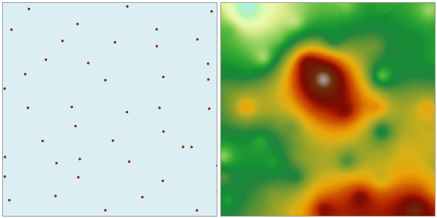

### Instructions

The spline interpolation method uses a mathematical expression with the minimum surface curvature to simulate a smooth curved surface that passes through a series of sample points.

* There must be a numeric field in the source dataset so that an interpolation field is available.
* Spline interpolation is suitable when there are a large amount of sample points and a smooth surface needs to be generated. The more interpolation points there are, the smoother the generated surface will be. Meanwhile, the more points there are, the longer it needs to process the data and output a grid.
* The fixed-length spline function method uses values that may be outside of the extent of the sample data to create a gradual and smooth surface. The variable-length spline method controls the hardness of a surface according to the characteristics of the simulated phenomenon. It uses values that are more restricted to the extent of sample data to create a less smooth surface.

**Function Entrance**

* Click **Spatial Analysis** > **Raster Analysis** > **Interpolation** > **Spline**.
* **Toolbox** > **Raster Analysis** > **Interpolation** > **Spline**. (iDesktopX) 

### Parameter Description

* Set the common parameters for interpolation analyses, including the source data, the interpolation bonds, the result data and environment settings. For details about setting the source data, the interpolation bounds, and the result data, please see: [Description of common parameters for interpolation](CommonPara).
* Set the mode to search for sample points. There are three supported modes: Fixed Count, Fixed Radius, and Block. For details about these three modes, please see: [Spline Interpolation](aboutinterpolation).
  - **Fixed Count** : indicates that a fixed number of sample points within the maximum radius extent will be used for interpolation.
     * **Max Radius** : input the radius for the Fixed Count search. The default value is 0, indicating that the maximum radius is used.
     * **Point Count** : input the point count for the Fixed Count search. The default value is 12.
  - **Fixed Radius** : indicates that all the sample points within the search radius extent will be used for interpolation.
     - * **Search Radius** : input the size of the search radius. All the sample points within this radius extent will be used in the interpolation. The default value is the diagonal length of the rectangle for the point dataset.
     - * **Min Count** : input the minimum count of points for the Fixed Count search. The default search radius is 1/5 of the greater value between the length and the width of the extent of the interpolation dataset. When the point count in the neighboring area is less than the specified minimum value, the search radius will increase until it contains the minimum number of points. The minimum number of points ranges from 0-12. The default is 5.
  - **Block** : The dataset is divided into blocks according to the specified maximum point count in each block. The value of an un-sampled point is then estimated through interpolation using the points in the corresponding block.
     * **Most Involved** : input the maximum count of points participating in the interpolation. The default value is 20. To avoid gaps in the interpolation result, the blocks will expand evenly outward during the real calculation process. "Most Involved" determines the expansion size of the blocks. Usually this value should be greater than the specified "Most in Block".
     * **Most in Block** : input the maximum count of points in each block. The default value is 5. If the point count in a block is greater than this value, this block is divided again; otherwise the division is stopped. **Most Involved** and **Most in Block** will directly affect the performance of Block searching. The greater these two values are, the longer the searching will take. Thus it is recommended that reasonable parameters are set for Block searching.
* **Tension**: input the tension value. The default value is 40. Tension is used to adjust the characteristics of the result surface. The greater the tension is, the smaller impact each point has to the calculation result, and vice versa.
* **Smoothing Factor**: input the value of the smooth factor. The value range is from 0 to 1, and the default value is 0.1. The smooth factor represents the degree of approximation to the points by the interpolation function curve. The greater this value is, the more deviation there will be between the curve and the points, and vice versa.
  
