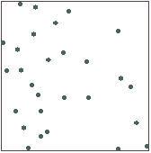
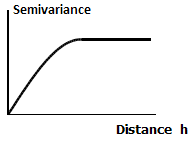
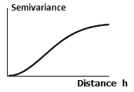
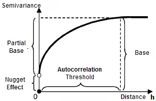

Interpolation is a process of predicting or estimating values at unmeasured points using sample points with known values. Interpolation within the extent is to estimate data for un-sampled points using known data at measured points within the same region. Extrapolation is to estimate data for other regions using data from a known region. They are both common concepts adopted in interpolation. SuperMap provides three interpolation methods for modeling or creating a surface. They are: Inverse Distance Weighted (IDW), (Kriging), and RBF. Which method to select usually depends on the distribution of sample data and the type of the surface to be generated. No matter which method is chosen, the more known data there are, the wider the sample points distribute, the more accurate the interpolation result will be.

### [Inverse Distance Weighted Interpolation](IDWinterpolation)

Inverse Distance Weighted (IDW) is based on the principle: closer things are similar. The principle assumes that two close sample points have similar attributes, and further sample points have less similar attributes. In this method, the value of a cell is a weighted average of the values of sample points nearby. A point closer to the cell at question carries larger weight. This is a simple and effective interpolation method. The computation speed is relatively fast.

Besides the weight distances, the power and search radius are also important factors affecting an IDW interpolation result.

* Power: Power affects the calculation result of weighted distances, and thus has a significant effect on the IDW interpolation result. A lower power produces a smoother interpolation result; a higher power produces more details in the interpolation result. The default power is 2.
* Search Radius: There are two ways to determine Search Radius for IDW interpolation:
  * **Fixed Count:** A fixed number of nearest sample points around the cell will participate in the interpolation calculation. For each cell, the number of sample points used in the interpolation calculation is fixed. In this case, the Search Radius is variable and depends on the density of sample points around the cell. If no enough sample points are found within the maximum search radius, only the points within the maximum search radius will be used;
  * **Fixed Radius:** All the sample points within a fixed radius will participate in the interpolation calculation for a cell. If the number of sample points within the fixed radius is less than the given minimum sample point count, the search radius will increase to include more sample points, so that the count of sample points used for interpolation will satisfy the minimum requirement.

The figure below is an illustration of an IDW interpolation. The interpolation field here is elevation; the resolution is 100; the search radius type is Fixed Count; all the points in the search radius are used for interpolation. The results are generated with the power of 1, 2, and 3, respectively.

### [Spline Interpolation](Splineinterpolation)

Spline function is a simulation of manual spline. It is a mathematical method to draw smooth curves through a series of sample points. Spline interpolation is a relatively accurate interpolation technique. It assumes that the attribute variation is smooth and has the following two characters: (1) The surface must accurately pass through all the sample points; (2) The surface has the minimum curvature. Spline interpolation is good at creating isolines and curves for which an appealing appearance is required.

Spline interpolation is suitable when there are a large amount of sample points and a smooth surface needs to be generated. When the variation of the surface is mild, this method can produce a good result. When surface values change dramatically over a short horizontal distance, or the existing sample data are not accurate enough, this method is not suitable.

There are three ways to determine Search Radius for spline interpolation:

* **Fixed Count:** A fixed number of nearest sample points around the cell will participate in the interpolation calculation. For each cell, the number of sample points used in the interpolation calculation is fixed. In this case, the Search Radius is variable and depends on the density of sample points around the cell. If no enough sample points are found within the maximum search radius, only the points within the maximum search radius will be used;
* **Fixed Radius:** All the sample points within a fixed radius will participate in the interpolation calculation for a cell. If the number of sample points within the fixed radius is less than the given minimum sample point count, the search radius will increase to include more sample points, so that the count of sample points used for interpolation will satisfy the minimum requirement.
* **Block:** The dataset is divided into blocks according to the specified maximum point count in each block. The value of an un-sampled point is then estimated through interpolation using the points in the corresponding block.

### Kriging

Based on spatial autocorrelation in data, Kriging uses a semivariogram model to perform an unbiased estimation of un-sampled points in a limited region. When spatial autocorrelation or a directional trend exists in sample points, Kriging is the best interpolation method. Data at sample points within a certain region have independence, i.e., spatial autocorrelation. The closer two sample points are, the higher the correlation between the two points is. Kriging is currently widely applied in soil science and geology.

* **Semivariogram model**

SuperMap supports three types of semivariograms: Spherical, Exponential, and Gaussian.

  * A spherical semivariogram reflects the case where spatial autocorrelation gradually decreases (i.e., the semivariogram value gradually increases) with the distance until the spatial autocorrelation reaches 0 after the distance exceeds a certain value. Spherical semivariograms are commonly used.
  

 * An exponential semivariogram reflects the case where spatial autocorrelation decreases exponentially as the distance increases. It is also a commonly-used model.
  

  * Gaussian models are suitable to the cases where the semivariogram value asymptotically approaches the Sill.
  
  * **Parameter descriptions**: A semivariogram model reflects the spatial autocorrelation in sample point data. A semivariogram model can be described through Range, Sill, and Nugget Effect.
    * **Range:** The semivariogram value tends to become stable after the distance (the value on the X axis) reaches a certain value. This distance value is Range. Data at sample points with a distance smaller than Range are correlated; data at sample points with a distance greater than Range are not correlated, i.e., these sample points do not affect the estimation result.
    * **Sill:** The top value (on the Y axis) of the semivariogram. Deducting Nugget Effect from Sill produces the partial sill, as shown below.  
    * **Nugget Effect:** The value at the intersection of the semivariogram and the Y axis when h=0 is called "Nugget Effect" in geological statistics. It indicates that a large spatial variation exists over a very short distance. It could be caused by measurement errors, or by the micro-variability in mineralization.

SuperMap provides three types of Kriging methods: Ordinary Kriging, Simple Kriging, and Universal Kriging.

- **[Ordinary Kriging:](OrdinaryKriging)** It performs a linear estimation on a regional variable. It assumes that the observation data are normally distributed and the expected value of the regional variable is unknown.
- **[Simple Kriging:](SimpleKriging)** It performs a linear estimation on a regional variable. It assumes that the observation data are normally distributed and the expected value of the regional variable is a fixed constant.
- **[Universal Kriging:](UniversalKriging)** It is used when a certain trend exists in the observation data and this trend can be simulated using a determinate function or polynomial.

Different interpolation methods are suitable for different conditions. Therefore, a proper interpolation method needs to be chosen during interpolation according to the characteristics of the data, so that the most accurate interpolation result can be produced. The table below compares the five interpolation methods in four aspects:

Method | Extrapolation ability | Degree of approximation | Computation capacity | Scope of application  
---|---|---|---|---  
IDW | Good when the distribution is even | Poor | Fast | Even distribution  
Spline | Good | High | Fast | Dense distribution  
Ordinary Kriging | Good | High | Slow | Any distribution  
Simple Kriging | Good | High | Slow | Any distribution  
Universal Kriging | Good | High | Slow | Any distribution  
  
### Related Topics

[Inverse Distance Weighted Interpolation](IDWinterpolation)

[Spline Interpolation](Splineinterpolation)

[Ordinary Kriging Interpolation](OrdinaryKriging)

[Simple Kriging Interpolation](SimpleKriging)

[Universal Kriging Interpolation](UniversalKriging)
