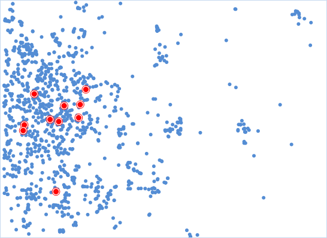

Identifies the most centrally located feature in a point, line, or polygon feature class.

### How Central Feature works

In the process of analysis, the cumulative distance of the center of mass of
each factor and the center of other elements is calculated, and the minimum
cumulative distance is the most central element. If the weight field is
specified, the central element is the element with the smallest cumulative
distance.

### Applications

  * In urban areas to create a new large sports venues, can find center from all of the block elements, but also according to the population of the weight calculation, can get away from all the other blocks through the location of the minimum cost as a candidate for the address.
  * Have multiple warehouses, a supermarket chain in the city now has just shipped a batch of goods, need to be distributed to each warehouse, in order to save transportation cost, find out the center warehouse, can according to the shortest path to distribute supplies.

### Function Entrances

  * Click **Spatial Analysis** > **Spatial Statistical Analysis** > **Measuring Geographic Distributions** > **Central Element**.
  * **Toolbox** > **Spatial Statistical Analysis** > **Measuring Geographic Distributions** > **Central Element**.

### Main Parameters

  * **Source Dataset** : Set up the vector dataset to be analyzed. If it is a line or region object, the center of mass of the object is calculated, the weight of the point is 1, the weight of the line is the length of the line, and the weight of the region is the area.
  * **Group Field** : Refers to a field that divides the analysis elements into categories. After classification, each group of objects has a central element. The Group Field can be of integer, date, or character type. Records with NULL values for the Group Field will be excluded from the analysis.
  * **Weight Field** : Refers to the weighting of each feature to other features. After setting the weight field, the distance is D = W1 x D, where W1 is the weight value and D is the distance between the two elements.
  * **Self Weight Field** : Refers to the cost of feature to other features. After setting its own weight, the distance is D = W1 x D + W2, where W1 is the weight value, D is the distance between the two features, and W2 is its weight value.
  * **Measure Distance Method** : Currently, only Euclidean distance calculation and Manhattanis distance calculation are supported, for more specific instructions about the two calculations, please refer to [Basic Vocabulary of Spatial Statistical Analysis](BasicVocabulary).
  * **Keep Statistics Field** : Refers to the retention field that sets the result data in the field list box, and the calculation of the field value.The fields shown in the list are the fields that are reserved for the resulting data, and the fields can be used to remove, add, select, and reverse, and select the field to set the statistical type of its retention value.
  * **Result Settings** : Set up the datasource and dataset to save the result data.

As shown in the figure below, blue dots denote supermarkets, and red dots are
the central supermarkets having the shortest accumulative distance to all the
other supermarkets. As the central supermarket, it has the shortest overall
transportation distance and the lowest total cost.

###  Related Topics

 [Mean center](MeanCenter)

 [Median center](MeanCenterResult)

 [Directional distribution](MeasureDirection)

 [Linear directional
mean](MeasureLinearDirectional)

 [Standard distance](MeasureStandardDistance)

* * *

  
  
---

