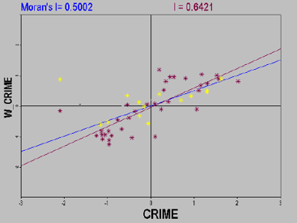
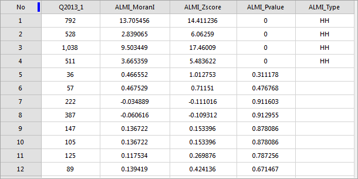
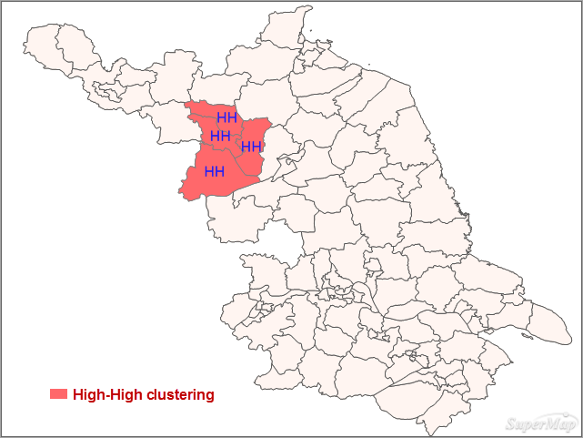

The cluster and outlier analysis can identify hot spots, cold spots and
abnormal space values with crowding and significance. The weighted features
are analyzed using Anselin Local Moran's I.

A scatter plot is used for presenting the correlation between two variables.
While a Moran scatter plot can show the spatial Moran autocorrelation of one
variable.

### Moran Scatter Plot

A Moran scatter plot is used for exploring the global spatial autocorrelation
to identify the spatial exceptions. The observation value of a variable at
each position and its spatial lag (Moran's I) are shown on the horizontal axis
and the vertical axis respectively.

A Moran scatter plot is decomposed into four quadrants which correspond with
four types of the spatial autocorrealtion.

  * The upper-right quadrant (H-H): both the observation value (zi) and the lag value are higher than the mean.
  * The lower-left quadrant (L-L): both the observation value (zi) and the lag value are lower than the mean.
  * The upper-left quadrant (L-H): the observation value (zi) is lower than the mean, but the lag value is higher than the mean.
  * The lower-right quadrant (H-L): the observation value (zi) is higher than the mean, but the lag value is lower than the mean.

The different quadrants imply the different spatial correlation.

  * The upper-right quadrant (H-H) and the lower-left quadrant (L-L) correspond with the positive spatial autocorrelation where values are similar at neighboring locations.
  * The lower-right quadrant (H-L) and the upper-left quadrant (L-H) quadrant correspond to negative spatial autocorrelation where values are dissimilar at neighboring locations. In the lower-right quadrant (H-L) and the upper-left quadrant (L-H), the low value is surrounded by high values and the high value is surrounded by low values. 
  * We refer to the upper-right quadrant and the lower-left quadrant as high-high (positive) and low-low (negative) spatial autocorrelation. Observing the relative density in the two quadrants can know about to what extent the spatial correlation mode is determined by the high-high or low-low correlation.
  * Observing the relative density in the upper-left quadrant and the lower-right quadrant can know which kind of spatial correlation is dominant. 
  * Besides, we can find out some potential spatial exceptions by observing the relative density in the upper-left quadrant and the lower-right quadrant. A Moran scatter plot is constructed by using the standardized variable and its lag. Draw a circle with the center of quadrants as its center and its radius is 2. The observation points falling outside of the circle are considered as outliers. 

A Moran significance map only shows the highly or lowly significant observed
values only. If these values are in the first or third quadrant, we consider
existing significant spatial clustering. But if these values are in the second
or fourth quadrant, we think that the significant spatial differences exist.

### Applications

  * Where are the sharpest boundaries between affluence and poverty in a study area? 
  * Where are the locations in a study area with anomalous spending patterns? 
  * Where are the unexpectedly high rates of diabetes across the study area? 

### Function Entrances

  * Click **Spatial Analysis** > **Spatial Statistical Analysis** > **Cluster Distributions** > **Cluster and Outlier Analysis**.
  * **Toolbox** > **Spatial Statistical Analysis** > **Cluster Distributions** > **Cluster and Outlier Analysis**.

### Main Parameters

  * **Source Dataset** : Set up the vector data sets to be analyzed, supports points, lines, and regions three types of datasets. 
  * **Assessment Field** : Specify a numerical field which will involve in the analysis.
  * **Concept Model** : Your choice for the Conceptualized Model should reflect inherent relationships among the features you are analyzing. The more realistically you can model how features interact with each other in space, the more accurate your results will be. 
    * Fixed Distance: It is suitable for point and region with large changes in region size.
    * Region Adjacent (Common Edges or Intersect): applicable to the data of adjacent side and intersection.
    * Region Adjacent (Adjacency Point, Common Edges or Intersect): applicable to the region data with adjacent points,adjacent sides and intersecting.
    * Inverse Distance: all features are regarded as adjacent features of all other features. All features affect the target features, but as distance increases, the effect is smaller, and the weight between the elements is one over the distance, which is applicable to continuous data.
    * Inverse Distance Square: similar to the "Inverse Distance Model", with the increase of distance, the influence decreases faster, and the weight between the features is one over the square of the distance.
    * k Nearest: The K features closest to the target features are contained in the calculation of the target features (the weight is 1), and the remaining features will be excluded from the target feature calculation (the weight is 0). This option is very effective if you want to ensure that you have a minimum number of contiguous features for analysis. This approach works well when the distribution of data changes in the study area so that some features are removed from all other features. When the proportion of fixed analysis is not as important as the number of fixed adjacent objects, k-nearest neighbor method is suitable.
    * Spatial Weight Matrix File: space weight matrix file is required. The spatial weight is a number that reflects the distance, time, or other cost of each feature and any other feature in the dataset. If you want to model the accessibility of city services, for example, to look for areas where urban crime is concentrated, it is a good idea to use the network to model spatial relationships. Before analyzing, create a spatial weight matrix file (.swmb) using the generated network space weight tool, and then specify the full path of the SWMB file created.
    * False Discovery Rate(FDR) Correction: The model is a combination of "Inverse Distance Model" and "Fixed Distance Model". Each feature is regarded as an adjacent feature of other features. This option is not suitable for large datasets. The features within the specified fixed distance range have equal weights (weights 1);In addition to the specified distance of fixed distance, the effect will be smaller as distance increases.
  * **Break Distance Tolerance** : "-1" means to calculate and apply the default distance, which is to ensure that each element has at least one adjacent feature;" 0 "means that no distance is applied, and each feature is an adjacent feature. Non-zero positive values are adjacent features when the distance between the features is smaller than this value.
  * **Inverse Distance Power Exponent** : The higher the exponent, the higher the power value, the smaller the exponential effect.
  * **Number of Adjacent Features** : Set a positive integer, indicating that the nearest K features around the target features are adjacent features.
  * **Measure Distance Method** : Currently, only Euclidean distance calculation and Manhattanis distance calculation are supported, for more specific instructions about the two calculations, please refer to [Basic Vocabulary of Spatial Statistical Analysis](BasicVocabulary).
  * **Spatial Weights Matrix Standardization** : When the distribution of elements is likely to deviate due to sampling design or the aggregation scheme imposed, the use of the line standardization is recommended. When you select the row normalization, each weight is divided by the sum of the rows(The sum of the weights of all adjacent features). The normalized weights are usually used in combination with the fixed distance adjacent features and are almost always used for the adjacent features of the adjacent side. This can reduce the deviation caused by the different number of adjacent features. Line standardization takes ownership weights, making them between 0 and 1, creating relative (rather than absolute) weight solutions. Whenever you want to handle the region features that represent administrative boundaries, you might want to choose the "line standardization" option.
  * **Whether FDR correction is conducted** :If the FDR (false discovery rate) is corrected, the statistical significance will be based on the false discovery rate correction, otherwise the statistical significance will be based on the p-value and z-score fields.

### Results Output

The result dataset of Cluster and Outlier Analysis will include four property
fields: local Moran's I, Gi_Zscore and Gi_Pvalue, clustering and outlier value
types, respectively ALMI_MoranI, ALMI_Zscore, ALMI_Pvalue, ALMI_Type four
fields. As shown in the figure below:

Because the analysis of clustering and outliers is based on 95% of the
confidence level, therefore, the value is only in the ALMI_Type field when the
P-value is less than 0.05. If the false discovery rate (FDR) correction,
statistical significance to correction of confidence threshold (p-value
reduced to a new value from 0.05) as the foundation, to juggle multiple tests
and spatial dependence.

P value (ALMI_Pvalue) | Moran index (ALMI_MoranI) | Implication | Cluster and outlier type (AIMI_TYPE)  
---|---|---|---  
P<0.05 | M>0 | High or low value cluster | HH (high-high cluster) or LL (low-low cluster)  
P<0.05 | M<0 | Outlier | HL(low values surround high values) or LH (high values surround low values)  
  
P value (ALMI_Pvalue) | Z score (ALMI_Zscore) | Implication | Cluster and outlier type (AIMI_TYPE)  
---|---|---|---  
P<0.05 | Z>0 | Similar values at neighboring locations. | HH (high-high cluster) or LL (low-low cluster)  
P<0.05 | Z<0 | Having an statistically significant outlier. | HL(low values surround high values) or LH (high values surround low values)  
  
**Instance** : Perform the Cluster and Outlier Analysis on the ratio and the
number of cases of viral hepatitis in a county in 2013. Set the Assessment
Field to the ratio and the number of cases. The Concept Model is set to
Inverse Distance, the Measure Distance Method is set to Euclidean Distance,
check the Spatial Weight Matrix Standardization checkbox and the False
Discovery Rate(FDR) Correction checkbox, and other parameters are set to
default values.

The results show that:

  * In the west-north area, the z scores are significant. Hence, the number of the diseases is high-high spatial autocorrelation.
  * The less spatial difference and the high-high spatial autocorrelation in the neighboring areas indicate patients with the disease here are more than other areas. And so, the medical units in the red area should prevent the increase of patients with the disease. 

Overall, Moran's Is of most of areas are not significant. The significant area
is high-high spatial autocorrelation.

Below for Pakistan and Afghanistan, for example, the results of the analysis
of the terrorist attacks in 2014-2016, the figure in the orange area for high
value clustering, green areas for low clustering, blue area for outliers.

###  Related Topics

[Hot spot analysis](HotSpotAnalyst)

[Analyzing patterns](AnalyzingPatterns)

* * *

  
  
---

