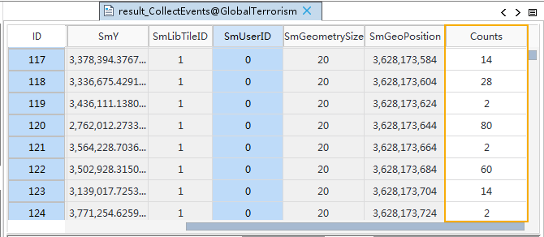

The tool "Collect Events" can convert event points to weighted points (such as
crime or disease incidents). It is used for simply processing data, aiming for
being used combining with other analysis features. It is applied to point,
line, or region datasets.

### Analysis theory

Collects events, and then turning event data into the weighted data.

  * The field "Counts" in the result dataset records the total of all centroids at each position.
  * The tool will process the objects with the same geographical centroids and only retain one centroid.
  * The centroids of point, line or region objects will be applied to the distance calculation. The centroid of an object is the weighted mean center of its all subobjects. The weighted item of a point is 1 (the centroid of a point is the point self), of a line is the line length, and of a polygon is the polygon area. 

### Function Entrances

  * Click **Spatial Analysis** > **Spatial Statistical Analysis** > **Utilities Tools** > **Collect Events**.
  * **Toolbox** > **Spatial Statistical Analysis** > **Utilities Tools** > **Collect Events**.

### Main Parameters

  * **Source data** : Set the vector dataset to be analyzed. The supported types of datasets include: point, line, region.
  * **Result Data** : Specify a datasource and a name to save the result dataset.

Take the terrorist attack data of Afghanistan and Pakistan from 1947 to 2016
as an example, performing the feature and getting the result as following
picture shown. The field "Counts" records the number of terrorist attacks at
each event position.

### Result topics

[Cluster and Outlier
Analysis](ClusterOutlierAnalyst)

[Optimized Hot Spot
Analysis](OptimizedHotSpotAnalyst)

[Analyzing Patterns](AnalyzingPatterns)

