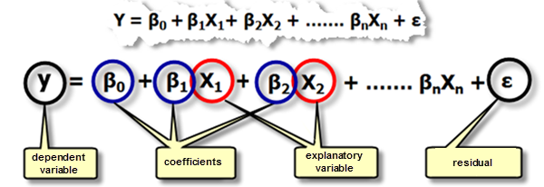
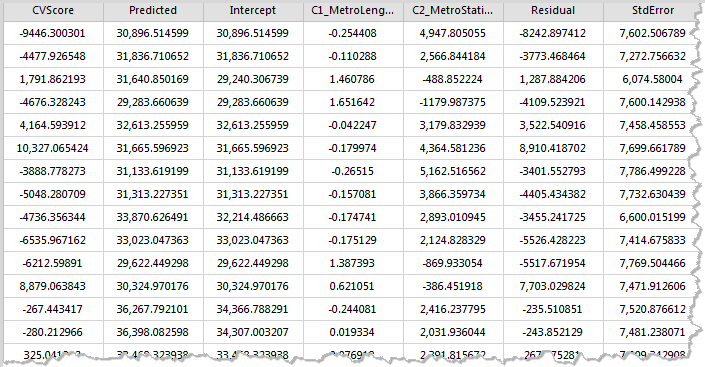
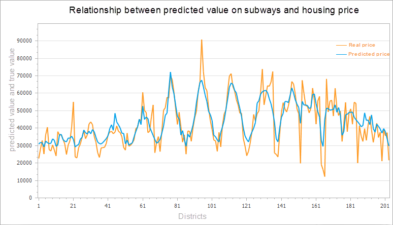
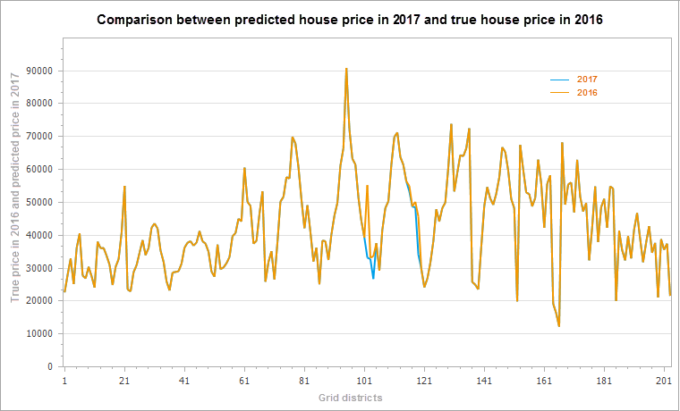

---
id: GeographicWeightedRegression
title: Geographically Weighted Regression Analysis
---
In addition to the analysis of spatial patterns, GIS analysis can be used to
explore or quantify relationship between features. The Modeling Spatial
Relationships tools model spatial relationships using regression analyses,
allowing you to make predictions for unknown values or to better understand
key factors influencing a variable you are trying to model.

The following types of questions can be solved: why does a phenomenon continue
to occur, and what factors contribute to this situation? Modeling a phenomenon
to predict other locations or other time values?

Geographically Weighted Regression is a new method of spatial analysis
proposed in recent years, which is a local regression model. By embedding
spatial structure into linear regression model, it probes into the
nonstationarity of spatial relationship. Regression analysis allows you to
model, examine, and explore spatial relationships and can help explain the
factors behind observed spatial patterns, can also the forecast of these
phenomena.

### How Geographically Weighted Regression Analysis works

Geographically Weighted Regression (GWR) is one of several spatial regression
techniques increasingly used in geography and other disciplines. GWR provides
a local model of the variable or process you are trying to understand/predict
by fitting a regression equation to every feature in the dataset. GWR
constructs these separate equations by incorporating the dependent and
explanatory variables of features falling within the bandwidth of each target
feature. The shape and size of the bandwidth is dependent on user input for
the Kernel type, Bandwidth method, Distance, and Number of neighbors
parameters. IT is a local form of linear regression for modeling space change
relations.

Geographical weighted regression equation is the mathematical formula applied
to the explanatory variables to best predict the dependent variable you are
trying to model. Unfortunately for those in the geosciences who think of x and
y as coordinates, the notation in regression equations for the dependent
variable is always **y** and for the independent or explanatory variable is
always **X**. Each independent variable is associated with a regression
coefficient describing the strength and the sign of that variable's
relationship to the dependent variable. A regression equation might look like
this (y is the dependent variable, Xs are the explanatory variables, and β are
regression coefficients.

Geographical weighted regression analysis should first identify a study area.
Calculate the decay function by using the different space position of each
feature. The decay function is a continuous function. Decay function with
this, when you put every feature of spatial location (typically coordinate
information (x, y)) and the value of the features into this function, you can
get a weight value (β). This value can be brought into the regression
equation. The W (UI, vi) in the decay function is the spatial weight matrix.

### Applications

Regression analysis is widely used to explain market share, sales, brand
preference and marketing effect. To express the relationship between two or
more fixed distance or proportional quantities is to solve the problem of
regression analysis. Some of the application examples include:

  * Modeling high school retention rates to better understand the factors that help keep kids in school.
  * Modeling traffic accidents as a function of speed, road conditions, weather, and so forth, to inform policy aimed at decreasing accidents.
  * Modeling property loss from fire as a function of variables such as degree of fire department involvement, response time, or property values. If you find that response time is the key factor, you might need to build more fire stations. If you find that involvement is the key factor, you may need to increase equipment and the number of officers dispatched.

### Function Entrances

  * Click **Spatial Analysis** > **Spatial Statistical Analysis** > **Modeling Spatial Relationship** > **Geographically Weighted Regression Analysis**.
  * **Toolbox** > **Spatial Statistical Analysis** > **Modeling Spatial Relationship** > **Geographically Weighted Regression Analysis**. (iDesktopX)

### Main Parameters

  * **Source Dataset** : Set up the vector data sets to be analyzed, supports points, lines, and regions three types of datasets. Note: the number of objects in the source data is greater than 20.
  * **Explanatory Field** :The explanatory variable is the independent variable, which is the X in the regression equation, which is used to model or predict the value of the dependent variable. For example, we want to study a number of reasons for obesity, to find out whether obesity is related to income, healthy food intake, or education levels. In this example, obesity is the dependent variable (Y), income, healthy food intake, education level and some other factors are the explanatory variables (X).
  * **Kernel Function Type** :The kernel type is the calculation function type that sets the distance between two points. The following five kernel function types are supported: W_ij is the weight between point I and point j. D_ij is the distance between point I and point j, and b is the bandwidth range. 
    * Quadratic Kernel: if d_ij<=b, W_ij=(1-(d_ij/b)2))2; Otherwise W_ij = 0.
    * Boxcar Kernel: if d_ij<=b, W_ij=1; Otherwise W_ij=0.
    * Gaussian Kernel: calculation formula is W_ij=e-((d_ij/b2)/2).
    * Triube Kernel: if d_ij<=b, W_ij=(1-(d_ij/b)3))3; Otherwise W_ij=0.
  * **Model Field** : Dependent variables, which are variables to be studied and predicted, only support numeric fields.
  * **Bandwidth Type** : Sets the way to determine the scope of the analysis bandwidth. Supports the following three types of determination: 
    * Akaike Information Criterion(AICC): The use of the Akaike information criterion (AICc) determines the bandwidth range for use in cases where the number of parameters is not determined or adjacent.
    * Cross Validation: Cross validation is used to determine the bandwidth scope, and cross-validation does not include the regression point itself when the regression coefficients are estimated, namely, the regression calculation is performed based on the data points around the regression point. This value is the difference between the estimated value and the actual value of each regression point in the cross validation, and their sum of squares is the CV value.Applies to the number of parameters that are not specified distance or adjacent elements.
    * Fixed Distance or Adjacent Number: To determine the bandwidth range based on fixed distance or fixed adjacent number, the number of distance or adjacent features must be set.
  * **Kernel Type** : Served both fixed and variable bandwidth: 
    * Fixed Bandwidth: If the bandwidth type you chosed is Fixed Distance or Adjacent Number, You need to specify a bandwidth-bound. If you choose the other two types, the program will calculate a fixed distance value according to your data.
    * Variable Bandwidth: If the bandwidth type you chose is Fixed Distance or Adjacent Number, you need to specify an adjacent number. The application will take the distance between the regression point and the nearest adjacent point as the range of the bandwidth. If you choose the other two types, the program will find out the nearest point and calculate a fixed distance value according to your data.
  * **Result Settings** : Set up the datasource for saving the result data.

### Results Output

The resulting dataset has these property fields: cross validation (CVScore),
the Predicted values (Predicted), regression coefficient (Intercept, C1 / _
the name of the Explain Field), Residual (Residual), standard error
(StdError), coefficient of standard error (SE / _Intercept, SE1 / _ the name
of the Explain Field), pseudo t value (TV_Intercept, TV1_ the name of the
Explain Field) and the Studentised Residual (StdResidual).As shown in the
figure below:

  * Cross Validation(CVScore): This value is the difference between the estimated value and the actual value of each regression point in the cross validation, and their sum of squares is the CV value, as a model performance indicator.

  * Predictive Value(Predicted): These values are estimates (or fitting values) of geographical weighted regression.

  * Regression Coefficient(Intercept): It is the regression coefficient of the geographical weighted regression model and the regression intercept of the regression model, indicating that all explanatory variables are the predicted values of the zero time dependent variables.

  * Regression Coefficient (C1_ _the name of the Explain Field): It is the regression coefficient of the explain field, indicating the relationship strength and type between the variables and the dependent variables. If the regression coefficient is positive, the relationship between variables and dependent variables is positive. Conversely, there is a negative relationship. If the relationship is strong, the regression coefficient is relatively large.When the relationship is weak, the regression coefficient is close to 0.

  * Residual (Residual): These are the parts that the dependent variable cannot explain, the difference between the estimate and the actual value. The mean value of the normalized residuals is 0, and the standard deviation is 1. The residual error can be used to determine the fitting degree of the model, and the residual difference indicates that the fitting effect of the model is better, which can explain the majority of predicted values, indicating that the regression equation is valid.

  * Standard Error(StdError): The standard error of estimates is used to measure the reliability of each estimate. The smaller standard error indicates that the smaller the difference between the fitting value and the actual value, the better the fitting effect of the model.

  * Standard Error of Coefficient (SE_Intercept, SE1_ _the name of the Explain Field): These values are used to measure the reliability of each regression coefficient estimate. The standard error of the coefficient is compared to the actual coefficient, and the estimate is more reliable. The larger standard error may indicate the existence of local multiple co-linear problems.

  * Pseudo T value(TV_Intercept, TV1_ _the name of the Explain Field): It is the significance test for each regression coefficient. When the T value is greater than the critical value, the null hypothesis is rejected, and the regression coefficient is significant, that is, the regression line estimate is reliable. When the T value is less than the critical value, the null hypothesis is accepted and the regression coefficient is not significant.

  * Studentised Residual (StdResidual): The ratio of residual and standard errors can be used to determine whether the data is abnormal. If the data is in the interval (-2, 2), it indicates that the data has normal and variance homogeneity. If the data exceeds the interval (-2, 2), it indicates that the data is abnormal data, without variance homogeneity and normality.

The figure below is a comparison between the predicted value of the
geographical weighted regression analysis and the actual value. According to
the housing price in downtown Beijing in 2016, the number of subway stations
around the city and the length of subway lines are explained to simulate the
housing prices in downtown Beijing in 2016. The orange line in the figure
below is the real house price, and the blue line is the fitting house price.

After successful execution, the output window will output the results of this
analysis. If the result of the analysis is in the user's acceptance range, the
results can be predicted according to the results and explanatory variables.

At this point, according to the attribute values of geographically weighted
regression analysis in the results and the new subway stations and subway
lines in 2017, to estimate the center of Beijing city house prices in 2017,
the calculation formula is: 2017 forecast prices = Intercept (regression
coefficient) + C1 (regression coefficient of explain field 1) * 2017 subway
station + C2 (regression coefficient of explain field 2) x 2017 subway line
length. According to the change information of the subway, the housing price
of Beijing central city will be predicted in 2017, as shown in the figure
below. As can be seen from the result chart, the housing price has a certain
fluctuation in the change of the subway line.

###  Related Topics

 [Basic vocabulary](BasicVocabulary)

 [Measuring geographic
analysis](MeasureGeographicDistributions)

 [Cluster analysis](Clusters)

 [Analyzing patterns](AnalyzingPatterns)

