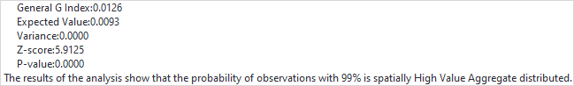

High/Low Clustering is the degree of clustering of high or low values using
the Getis-Ord General G statistics. The General G index is also a corollary
statistic that USES limited data to estimate the overall situation. When the
p-value returned by this tool is small and statistically significant, the null
hypothesis can be rejected. If the z-score value is positive, the observed
General G index is larger than the expected General G index, indicating high
values for the attribute are clustered in the study area. If the z-score value
is negative, the observed General G index is smaller than the expected index,
indicating that low values are clustered in the study area.

### Applications

  * Look for unexpected spikes in the number of emergency room visits, which might indicate an outbreak of a local or regional health problem.
  * Comparing the spatial pattern of different types of retail within a city to see which types cluster with competition to take advantage of comparison shopping (automobile dealerships, for example) and which types repel competition (fitness centers/gyms, for example). 
  * Summarizing the level at which spatial phenomena cluster to examine changes at different times or in different locations. For example, it is known that cities and their populations cluster. Using High/Low Clustering analysis, you can compare the level of population clustering within a single city over time (analysis of urban growth and density). 

### Function Entrances

  * Click **Spatial Analysis** > **Spatial Statistical Analysis** > **Analyzing Mode** > **High/Low Clustering**.
  * **Toolbox** > **Spatial Statistical Analysis** > **Analyzing Mode** > **High/Low Clustering**. (iDesktopX)

###  Main Parameters

  * **Source data** : Specify a dataset (point, line or region) for the analysis. 
  * **Assessment Field** : Specify a numerical field which will involve in the analysis.
  * **Concept Model** :Your choice for the Conceptualized Model should reflect inherent relationships among the features you are analyzing. The more realistically you can model how features interact with each other in space, the more accurate your results will be. 
    * Fixed Distance: applicable to point and region with large changes in region size.
    * Region Adjacent (Common Edges or Intersect): applicable to the data of adjacent side and intersection.
    * Region Adjacent (Adjacency Point, Common Edges or Intersect): applicable to the region data with adjacent points,adjacent sides and intersecting.
    * Inverse Distance: all features are regarded as adjacent features of all other features. All features affect the target features, but as distance increases, the effect is smaller, and the weight between the elements is one over the distance, which is applicable to continuous data.
    * Inverse Distance Square: similar to the "Inverse Distance Model", with the increase of distance, the influence decreases faster, and the weight between the features is one over the square of the distance.
    * k Nearest: The K features closest to the target features are contained in the calculation of the target features (the weight is 1), and the remaining features will be excluded from the target feature calculation (the weight is 0). This option is very effective if you want to ensure that you have a minimum number of contiguous features for analysis. This approach works well when the distribution of data changes in the study area so that some features are removed from all other features. When the proportion of fixed analysis is not as important as the number of fixed adjacent objects, k-nearest neighbor method is suitable.
    * Spatial Weight Matrix File: space weight matrix file is required. The spatial weight is a number that reflects the distance, time, or other cost of each feature and any other feature in the dataset. If you want to model the accessibility of city services, for example, to look for areas where urban crime is concentrated, it is a good idea to use the network to model spatial relationships. Before analyzing, create a spatial weight matrix file (.swmb) using the generated network space weight tool, and then specify the full path of the SWM file created.
    * Undifferentiated Regional:The model is a combination of "Inverse Distance Model" and "Fixed Distance Model". Each feature is regarded as an adjacent feature of other features. This option is not suitable for large datasets. The features within the specified fixed distance range have equal weights (weights 1);In addition to the specified distance of fixed distance, the effect will be smaller as distance increases.
  * **Break Distance Tolerance** :"-1" means to calculate and apply the default distance, which is to ensure that each element has at least one adjacent feature;" 0 "means that no distance is applied, and each feature is an adjacent feature. Non-zero positive values are adjacent features when the distance between the features is smaller than this value.
  * **Inverse Distance Power Exponent** :The higher the exponent, the higher the power value, the smaller the exponential effect.
  * **Number of Adjacent Features** :Set a positive integer, indicating that the nearest K features around the target features are adjacent features.
  * **Measure Distance Method** : Currently, only Euclidean distance calculation and Manhattanis distance calculation are supported, for more specific instructions about the two calculations, please refer to [Basic Vocabulary of Spatial Statistical Analysis](BasicVocabulary).
  * **Spatial Weights Matrix Standardization** :When the distribution of elements is likely to deviate due to sampling design or the aggregation scheme imposed, the use of the Spatial Weights Matrix Standardization is recommended. After selecting it, each weight is divided by the sum of the rows (the sum of the weights of all adjacent features). The normalized weights are usually used in combination with the fixed distance adjacent features and are almost always used for the adjacent features of the adjacent side. This can reduce the deviation caused by the different number of adjacent features. Spatial Weights Matrix Standardization takes ownership weights, making them between 0 and 1, creating relative (rather than absolute) weight solutions. Whenever you want to handle the region features that represent administrative boundaries, you might want to choose the "Spatial Weights Matrix Standardization" option.

### Results Output

The analysis result includes five parameters: General G Index, Expected Value,
Variance, Z-score, and P-value. The High/Low Clustering (Getis-Ord General G)
tool is an inferential statistic, which means that the results of the analysis
are interpreted within the context of the null hypothesis. When the p-value
returned by this tool is small and statistically significant, the null
hypothesis can be rejected. If the null hypothesis is rejected, then the sign
of the z-score becomes important. If the z-score value is positive, the
observed General G index is larger than the expected General G index,
indicating high values for the attribute are clustered in the study area. If
the z-score value is negative, the observed General G index is smaller than
the expected index, indicating that low values are clustered in the study
area.

The results show that the P value is less than 0.01, Z score is greater than
2.58, and distribution is clustering distribution with 99% confidence. The
general G value is higher than the expected value and Z value is significant.
The result shows that the ratio and number of incidents in 2013 tend to be
highly clustered. It shows that the ratio and the number of incidents of the
disease are clustered in high-value areas.

Result | High/Low Clustering  
---|---  
The p-value is **not** statistically significant. | You can't reject the null hypothesis. It is quite possible that the spatial distribution of feature attribute values is the result of random spatial processes. Said another way, the observed spatial pattern of values could well be one of many, many possible versions of complete spatial randomness. |  
The p-value **is** statistically significant, and the z-score is positive.|You may reject the null hypothesis. The spatial distribution of **high** values in the dataset is more spatially clustered than would be expected if underlying spatial processes were truly random.  
The p-value **is** statistically significant, and the z-score is negative.| You may reject the null hypothesis. The spatial distribution of **low** values in the dataset is more spatially clustered than would be expected if underlying spatial processes were truly random.  
  
**Instance** :

Perform the Cluster and Outlier Analysis on the ratio and the number of cases
of viral hepatitis in a county in 2013. Set the Assessment Field to fields
recording the ratio and the number of cases. The Concept Model is set to
Inverse Distance, the Measure Distance Method is set to Euclidean Distance,
check the Spatial Weight Matrix Standardization checkbox, and other parameters
are set to default values.

The results show that the P value is less than 0.01, Z score is greater than
2.58, and distribution is clustering distribution with 99% confidence. The
general G value is higher than the expected value and Z value is significant.
The result shows that the ratio and number of incidents in 2013 tend to be
highly clustered. It shows that the ratio and the number of incidents of the
disease are clustered in high-value areas.

###  Related topics

[Spatial autocorrelation](SpatialAutocorrelation)

[Incremental spatial
autocorrelation](IncrementalSpatialAutocorrelation)

[Average nearest neighbor](AverageNearestNeighbor)

