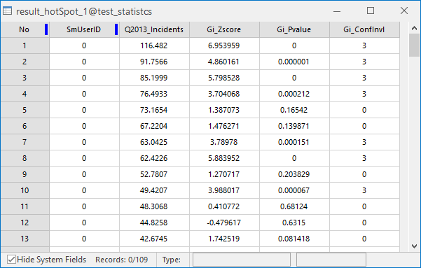
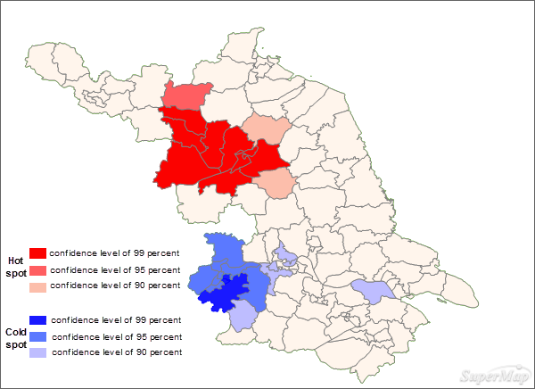

Given a set of weighted features, the Hot Spot Analysis can identify
statistically significant hot spots and cold spots using the local General G
index statistic. Hot spot analysis looks at each feature at a neighboring
environment. Therefore, a feature with high value may not be a hot spot. A
feature that has high value and is surrounded by features with high values is
a hot spot. In contrast, a feature that has low value and is surrounded by
features with low values is a cold spot.

### Applications

Applications can be found in crime analysis, epidemiology, voting pattern
analysis, economic geography, retail analysis, traffic incident analysis, and
demographics. Some examples include the following:

  * Where is the disease outbreak concentrated? 
  * Where are kitchen fires a larger than expected proportion of all residential fires?
  * Where should the evacuation sites be located?
  * Where/When do peak intensities occur?
  * Which locations and at during what time periods should we allocate more of our resources?

### Function Entrances

  * Click **Spatial Analysis** > **Spatial Statistical Analysis** > **Cluster Distributions** > **Hotspot Analysis**.
  * **Toolbox** > **Spatial Statistical Analysis** > **Cluster Distributions** > **Hotspot Analysis**. (iDesktopX)

### Main Parameters

  * **Source Dataset** : Set up the vector data sets to be analyzed, supports points, lines, and regions three types of datasets. 
  * **Assessment Field** : Specify a numerical field which will involve in the analysis.
  * **Concept Model** : Your choice for the Conceptualized Model should reflect inherent relationships among the features you are analyzing. The more realistically you can model how features interact with each other in space, the more accurate your results will be. 
    * Fixed Distance: applicable to point and region with large changes in region size.
    * Region Adjacent (Common Edges or Intersect): applicable to the data of adjacent side and intersection.
    * Region Adjacent (Adjacency Point, Common Edges or Intersect): applicable to the region data with adjacent points,adjacent sides and intersecting.
    * Inverse Distance: all features are regarded as adjacent features of all other features. All features affect the target features, but as distance increases, the effect is smaller, and the weight between the elements is one over the distance, which is applicable to continuous data.
    * Inverse Distance Square: similar to the "Inverse Distance Model", with the increase of distance, the influence decreases faster, and the weight between the features is one over the square of the distance.
    * k-Nearest: The K features closest to the target features are contained in the calculation of the target features (the weight is 1), and the remaining features will be excluded from the target feature calculation (the weight is 0). This option is very effective if you want to ensure that you have a minimum number of contiguous features for analysis. This approach works well when the distribution of data changes in the study area so that some features are removed from all other features. When the proportion of fixed analysis is not as important as the number of fixed adjacent objects, k-nearest neighbor method is suitable.
    * Spatial Weight Matrix File: space weight matrix file is required. The spatial weight is a number that reflects the distance, time, or other cost of each feature and any other feature in the dataset. If you want to model the accessibility of city services, for example, to look for areas where urban crime is concentrated, it is a good idea to use the network to model spatial relationships. Before analyzing, create a spatial weight matrix file (.swmb) using the generated network space weight tool, and then specify the full path of the SWMB file created.
    * Undifferentiated Regional:The model is a combination of "Inverse Distance Model" and "Fixed Distance Model". Each feature is regarded as an adjacent feature of other features. This option is not suitable for large datasets. The features within the specified fixed distance range have equal weights (weights 1);In addition to the specified distance of fixed distance, the effect will be smaller as distance increases.
  * **Break Distance Tolerance** :"-1" means to calculate and apply the default distance, which is to ensure that each element has at least one adjacent feature;" 0 "means that no distance is applied, and each feature is an adjacent feature. Non-zero positive values are adjacent features when the distance between the features is smaller than this value.
  * **Inverse Distance Power Exponent** :The higher the exponent, the higher the power value, the smaller the exponential effect.
  * **Number of Adjacent Features** :Set a positive integer, indicating that the nearest K features around the target features are adjacent features.
  * **Measure Distance Method** : Currently, only Euclidean distance calculation and Manhattanis distance calculation are supported, for more specific instructions about the two calculations, please refer to [Basic Vocabulary of Spatial Statistical Analysis](BasicVocabulary).
  * **Whether FDR correction is conducted** :If the FDR (false discovery rate) is corrected, the statistical significance will be based on the false discovery rate correction, otherwise the statistical significance will be based on the Gi_Pvalue and Gi_Zscore fields.
  * **Self Weight Field** :Set up the distance weight value, only supports numeric fields.
  * **Result Settings** :Set up the datasource for the result data and the dataset name.

### Results Output

The result dataset obtained by performing the hot spot analysis contains three
attribute fields: Gi_Zscore, Gi_Pvalue, and Gi_ConfInvl. The following table
details their implication.

Gi_Zscore | Implication | Hot/Cold Spot  
---|---|---  
Z>0 and P value is small | High-high spatial cluster. The larger the z-score, the greater the clustering degree. | Hot spot. The corresponding Gi_ConfInvl is positive.  
Z is closer to 0 | No obvious spatial clustering | \--  
Z<0 and P value is small< | Low-low spatial cluster. The smaller the z-score, the greater the clustering degree. | Cold spot. The corresponding Gi_ConfInvl is negative.  
  
In the attribute table, the values of each field indicate:

Gi_Zscore(Standard Deviations) | Gi_Pvalue(probability) | Gi_ConfInvl value | Gi_ConfInvl | Analysis Result  
---|---|---|---|---  
<-2.58  | <0.01 | -3 | 99% | Cold spot which has statistically significance with 99 percent confidence level.  
<-1.96  | <0.05 | -2  | 95% | Cold spot which has statistically significance with 95 percent confidence level.  
<-1.65 | <0.1 | -1 | 90% | Cold spot which has statistically significance with 90 percent confidence level.  
smaller and closer to 0 | \-- | 0 | \-- | No statistical significance.  
\>1.65 | <0.1  | 1 | 90% | Hot spot which has statistically significance with 90 percent confidence level.  
\>1.96  | <0.05 | 2  | 95% | Hot spot which has statistically significance with 95 percent confidence level.  
\>2.58  | <0.01 | 3 | 99% | Hot spot which has statistically significance with 99 percent confidence level.  
  
For instance, perform the Hotspot Analysis on the ratio of cases of viral
hepatitis in a county in 2013. Set the Assessment Field to the field recording the number of cases. The Concept Model is set to Inverse Distance. The Measure Distance Method is set to Euclidean Distance. Check the Spatial Weight Matrix Standardization checkbox and other parameters are set to default values.

Under the assumption of random distribution, the results show that:

  * In the west-north area, all of the z scores are larger than 2.58. Features in this area is surrounded by features with high values. Hence, the area shows the high-high cluster, which means viral hepatitis has a high incidence in this area. And so, in this area, people should take preventive measures more seriously. 
  * While, in the dark blue area, all of the z-scores are smaller than -2.58. Features in this area is surrounded by features with low values. Hence, the area (cold area) shows the low-hlow cluster. 
  * Z-scores in pink areas are closer to 0 without statistical significance.

###  Related Topics

[Cluster and outlier
analysis](ClusterOutlierAnalyst)

[Optimized hot spot
analysis](OptimizedHotSpotAnalyst)

[Analyzing patterns](AnalyzingPatterns)

