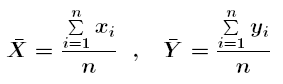
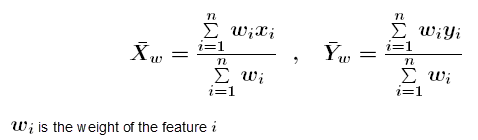
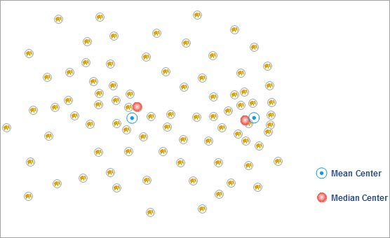

The Mean Center function can be used to identify the center of density of a
set of core elements, namely the geographic average center.The result is a new
point, not an object in the source data.

### How Mean Center works

The calculation method of the mean center is simple. The x coordinate and y
coordinates of the center point can be calculated directly. The mean of the
x-coordinate and the y-coordinate of all points is as follows:

If the weighted field of the average center is set, the position of the center
point needs to consider the weight value, and the calculation formula is as
follows:

### Applications

  * A crime analyst might want to see if the mean center for burglaries shifts when evaluating daytime versus nighttime incidents. This can help police departments better allocate resources.
  * A wildlife biologist can calculate the mean center of elk observations within a park over several years to see where elk congregate in summer and winter to provide better information to park visitors.

### Function Entrances

  * Click **Spatial Analysis** > **Spatial Statistical Analysis** > **Measuring Geographic Distributions** > **Mean Center**.
  * **Toolbox** > **Spatial Statistical Analysis** > **Measuring Geographic Distributions** > **Mean Center**. (iDesktopX)

### Main Parameters

  * **Source Dataset** : Set up the vector data sets to be analyzed, supports points, lines, and regions three types of datasets. If it is a line or region object, the center of mass of the object is calculated, the weight of the point is 1, the weight of the line is the length of the line, and the weight of the region is the area.
  * **Group Field** : Refers to a field that divides the analysis elements into categories. After classification, each group of objects has a central element. The Group Field can be of integer, date, or string type. Records with NULL values for the Group Field will be excluded from the analysis.
  * **Weight Field** : Refers to the weighting of each element to other elements. After setting the weight field, the distance is D = W1 x D, where W1 is the weight value and D is the distance between the two elements.
  * **Keep Statistics Field** : Refers to the retention field that sets the result data in the field list box, and the statistical type of the field value.
  * **Result Settings** : Set up the datasource for the result data and the dataset name.

After setting up the above parameters, click the "OK" button in the dialog box
to perform the Mean Center analysis.

As the following picture shows: the yellow points indicate the activity
locations of elephants in a wild zoo. We can determine where these elephants
cluster at by performing the Mean Center analysis, thereby providing optimal
locations for tourists.

###  Related Topics

 [Central feature](CentralFeature)

 [Median center](MeanCenterResult)

 [Directional distribution](MeasureDirection)

 [Linear directional mean](MeasureLinearDirectional)

 [Standard distance](MeasureStandardDistance)

