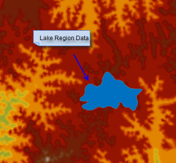

### Build DEM

Digital Elevation Model (DEM) is used to display the terrain characteristics.
DEM is mainly used to describe the spatial distribution of the landform types,
and it is got by interpolation or imitation computing with measured elevation
points (or points got by sampling from the contours). The DEM building
function in SuperMap creates DEM data by interpolating point or line data, and
the result is a raster dataset.

There are three methods for terrain building:

  1. Create DEM with point (elevation point) data, it is similar with interpolation.
  2. Create DEM with line data (contour), strengthen some features, such as ridge lines, valley lines, etc.
  3. Create DEM with point data (elevation point) and line data (contour). The DEM generated by this method have more three-dimensional effect because the elevation information of feature points (such as mountain top, depressions, ridges, valleys points, etc.) is added to it.

In fact, when building with line data, the application will extract points
from the line objects, then build the terrain by interpolating the point data.

To build terrain, it is needed to understand the following concepts.

* **Source dataset and elevation field**: The source dataset(s) can be one or several point dataset(s), one or several line dataset(s), or both point dataset(s) and line dataset(s). No matter what kind of source dataset(s) you use, the dataset(s) must have an elevation field which stores the terrain feature information.

  * **Interpolation types**: The application provides three interpolation types, TIN, IDW and Kriging.

    * IDW estimates the value of the cell by calculating the average value of discrete point group in the neighboring area, it is a simple and effective data interpolation method, and the computing speed is fast.
    * The TIN method creates a TIN model with the given line dataset, then create terrain with the given extreme point information (optional), and lake information (optional). TIN model can reflect the terrain features, but the data structure is complex, and it is suitable for small area terrain calculating.
    * The idea of the Kriging method is the same with ordinary kriging interpolation method, the data structure is simple, very suitable for the construction of large area macro topography.
* **The handling of repeated points**

The source data may have repeat points (nodes of line objects) due to various reasons, if two repeat points have different elevation values, it is needed to determine the elevation value to use in the terrain building. Application provides two kinds of processing modes, the first is to use the elevation value of the first point, and remove the points that overlap with the point; Another is using the statistics value of all elevation values of the repeated point, such as mean value, maximum, minimum, mode, median, etc.

* **The resampling distance**

This parameter is used for the resampling of line data, it filters the intensive nodes and improve the speed of creating the TIN model. Note: The resampling distance parameter is available only when there is line dataset(s) in the source data and the interpolation method is TIN. The default value is 0.0, that is do not resampling. For the resampling of line object and the introduction of resampling distance, see: [Resample](../../DataProcessing/Objects/EditObjects/ReSampleIntro).

* **Elevation zoom scale**

The degree the elevation is stretched. The larger the value, the greater the stretch. 1 means do not stretch. It is the multiples of the original elevation.

* **The lake region data and elevation field**

The lake dataset stores the lake information, each region object represent one lake. The lake dataset uses one field to identify the elevation of the lake. The elevation value will be used as the raster value of the cell on the corresponding location of the result dataset. The region data selected does not necessarily be a lake, it can be any region that can be viewed as a barrier and need to be handled individually, such as hollow or ice coverage.

* **Extent data**: Extent data is 2D region data, the application determines the extent of the terrain data created according to the extent of the border object. The border data can help you extract the terrain of the interested area or remove the area you don't need, for example, set the administrative region as the clip dataset to extract the terrain data of the region. There are two methods for using the border data, set the clip dataset or erase dataset to identify the border extent of the terrain created.
    * If a clip dataset is specified, when creating terrain, only the extent covered by the region object will be generated, the cells outside of the region will be assigned as NoValue.
    * If a erase dataset is specified, when creating terrain, the cells inside of the extent covered by the region objects stored in the dataset will be assigned as NoValue. Note: The erase dataset is supported only when the interpolation mode is TIN.
    * If not clip data or erase data is specified, the extent of the terrain data created will be the union of the source dataset.
* **The result data**

Set the following parameters for the terrain result created, including the
datasource to save the result, the name of the result dataset, the encoding
type, pixel format, resolution, etc. After the resolution of the terrain is
determined, the application will calculate the count of rows and count of
columns automatically, and estimate the size of the dataset, the unit is MB.

### Dig Lake

In the actual landform, terrain is not just the ups and downs, it may contain
objects like lakes, rivers, reservoirs, depressions, glaciers. By specifying
region data (such as lakes) which has elevation information in the build
process, the information of the object can be added to ensure the terrain
built is close to the actual terrain.

The application provides two methods of the dig lake functionality, the
difference lies in the specify mode of the elevation value of the lake:

  * Specify the elevation value directly, that is change the elevation of the terrain data in the lake extent to the elevation value specified by the user.
  * Dig lakes according to given elevation field. This is a process of changing elevation value of the terrain data in the region to specified field value.

The following is a sketch map for DEM dig lake

