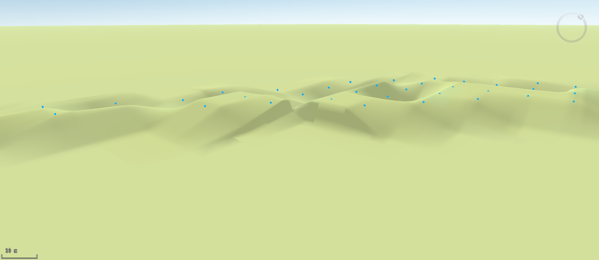

### Instructions

With the feature Build DEM, we can build terrain in big size. But if there are
only tiny parts of terrain changed, we can adjust the changed parts with the
feature Points and Terrain Matching. Based on the original terrain,
interpolates data using elevation points (or samples contours and extracts
elevation points) and then generates new DEM data.

### Function Entrances

  * Click **Spatial Analysis** > **Raster Analysis** > **Build DEM** > **Point Matches Terrain**.
  * **Toolbox** > **Raster Analysis** > **Build DEM** > **Point Matches Terrain**. (iDesktopX)

### Parameter Description

  * **DEM Data** : Specify the DEM data to be modified in the DEM Data area.
  * **Point Data** : Specify the required 3D point dataset in the Point Data area.
  * **Buffer Radius (m)** : enter the buffer radius. 5 meter is by default.
  * **Result Data** : specify the result dataset' name and the datasource to save the result dataset.
  * Add the newly generated raster dataset to the current scene as terrain or an image. To display data successfully, you need to create an image pyramid of the dataset.

The following pictures show the comparison of original data and result data.

  
