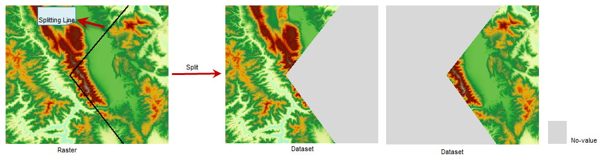

### Introduction

Split is used when you need to use part of the existing raster data as the
range of study and you want to retain the spatial extent of the original
raster data.

Split the raster dataset with the given 2D line (called "split line"), the
result are two new raster datasets on the left and right of the line. The
split line can be straight line, polygonal line or polygon. the left or right
is the left or right of the points array on the split line. If the center
point of a cell is on the left of the split line, the cell will be assigned to
the left part.

  

  
### Operation

  1. Click **Spatial Analysis** > **Raster Analysis** group > **Surface Analysis** > **Split DEM** And then draw a line on your map and right click to open the **Split DEM** dialog box.
  2. Set the data for the split operation. Select the source dataset to split and the datasource that contains it.
  3. Set the Result data, select the target datasource to save the result datasets, name the result datasets.
  4. Click OK to perform the split operation, or click Cancel to given up the current operation.

### Note

The difference between DEM split and raster map clip, the two result datasets
of DEM split have the same spatial extent with the original raster data, the
cell without value will be assigned NoValue, but the result of raster map clip
is one dataset, and the spatial extent is less then extent of the original
data.

### Related Topics

[Clipping Maps](../../DataProcessing/ClippingMap/MapClip_basic)
