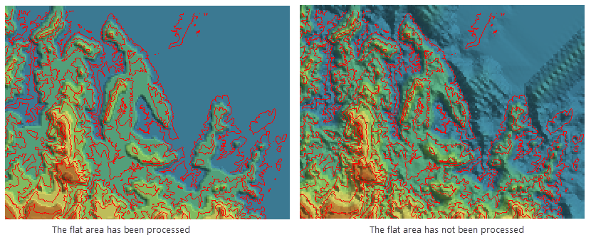

### Introduction

Terrain data is the basis of terrain analysis. For example, we can use terrain
data to extract the basic terrain factors such as slope and aspect, and to do
hydrology analysis, visibility analysis and other complex terrain analysis.
Only when the high-quality terrain data is built, can we ensure the results of
the subsequent analyses are reliable.

The building DEM function helps users to build terrain based on the specified
parameters, and to modify elevations according to the specified range.

### Function Entrances

  * Click **Spatial Analysis** > **Raster Analysis** > **Build DEM** > **Build DEM**.
  * **Toolbox** > **Raster Analysis** > **Build DEM** > **Build DEM**. (iDesktopX)

### Parameter Description

  * **Source Data** : Select the vector data for building DEM.
  * **Lake Data** : Sets the lake data used for digging lakes. The application uses the elevation values of lake data field to replace the cell values of the corresponding positions of the DEM data.
  * **Clip Data** : Sets the clip dataset. The cells covered by the clip dataset will be generated into DEM, whereas the cells outside the clip dataset will be assigned no value.
  * **Erase data** : Sets the erase dataset. The cells inside the erase dataset will be assigned no value, whereas the cells outside it will not be done any processing. 
  * **Parameter Settings**
    * **Interpolation Type** : Sets the interpolation method. The application provides three interpolation methods including triangulated irregular network (TIN), inverse distance weighted (IDW) and Kriging. For the introduction of these methods, see [Building DEM Overview](AboutTerrainBuilder). 
    * **Process Repeat Point** : Sets the processing method of repeat points. In some cases, the source data used to build DEM have repeat points (nodes of lines). The application provides two methods: One is using the elevation of one of these repeat points and then removing the other points; the other is using the statistical value of all the repeat points such as average, maximum (minimum) value, mode and median. 
      * **Average**: Takes the average of these repeat points as the elevation of the location.
      * **Median** : Takes the median of these repeat points as the elevation of the location.
      * **Mode** : Takes the ??most frequent elevation value of all the repeat points as the elevation of the location.
      * **Max** : Takes the maximum value of these repeat points as the elevation of the location.
      * **Min** : Takes the minimum value of these repeat points as the elevation of the location.
    * **Resample Distance** : Sets the resampling tolerance which is the vertical distance from a node of a line to the connected line of the two adjacent nodes of the line. The greater the distance, the simpler the resampling result. For the introduction of resampling, see [Resampling of Line Objects](../../DataProcessing/Objects/EditObjects/ReSampleIntro).
    * **Z Factor** : Sets the stretch degree of the elevation. The greater the value, the greater the stretch and the more exaggerated the terrain. The coefficient 1 denotes no stretch. The unit is times which is the times of the elevation relative to the original elevation. 
    * **Flat Area Process** : The flat area is generally considered as the area where no adjacent contours can be interpolated into at the peak or valley floor. If you specify the flat area being processed, the flat area will own the elevation by adding interpolation point into the flat area. Otherwise, no opertation will be none on the flat area. As following pictures shows, the red lines are contours. The DEM data that the flat area is processed is more close to the real terrain, but the DEM without processing the flat area is more smooth.

  

  * **Result Data Settings**
    * **Datasource** : The datasource that the generated terrain data save into. 
    * **Dataset** : The name of the generated terrain (or raster) data.
    * **Encoding** : Sets the encoding mode of the generated terrain data. The application provides 3 ways for this: None, SGL and DCT. For more information, see [Dataset Compression Encoding](../../DataProcessing/DataManagement/EncodeType). 
    * **Format** : Sets the pixel format of the generated terrain data. The application provides a variety of common formats including UBit1, UBit4, UBit8, UBit24, Bit16, Bit32, Bit64, single and double. For more information, see [Raster Dataset Pixel Format](../VectorRasterConvert/PixelFormat).
    * **Resolution** : Sets the resolution of the generated DEM data. The calculation formula of the resolution is L/500 by default, in which, L denotes the length of the boundary which is the maximum boundary of the widths and heights of the result dataset. 500 denotes the count of cells within boundary L by default. The result is the size of each cell. It has the same unit with the coordinate system of the vector data which is used for generating DEM. 

According to the input resolution by users, the application will automatically estimate the number of the columns and rows of the generated DEM as well as the size of DEM (unit: MB).

  * **Other Settings** : This tab is mainly used to set the lake data for digging lake as well as the clip data and erase data. All these parameters are optional.

###  Notes

  * For the massive point or line data, you can use **TIN** to create DEM data, but it requires a high computer's memory. Before performing this operation, you need to make sure your computer has enough memory for the operation; otherwise it may fail to build DEM due to the insufficient memory.
  * Currently the application doesn't support using IDW and Kriging to create DEM for the massive point or line data. 

###  Related Topics

[Building DEM Overview](AboutTerrainBuilder)

