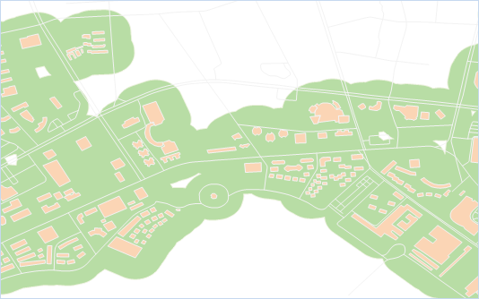
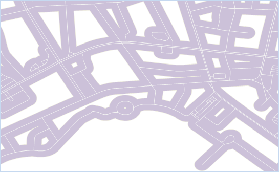
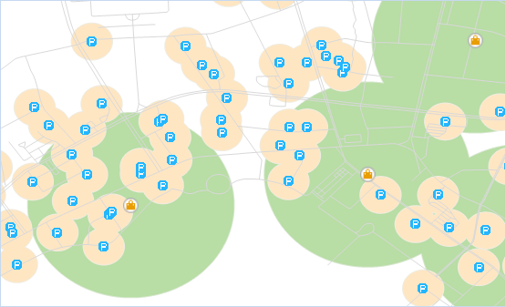
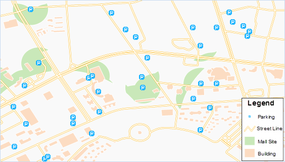

---
id: BufferAnalyst_Example
title: Sample Application of Buffer Analysis  
---  
Traffic, parking, guests, etc are concerned factors for selecting an optimal
site for a shopping mall. In this sample, multiple factors are considered in
using buffer analysis for site selection. Site selection criterion:

  * 100m within residences;
  * 50m within main roads;
  * 100m within the parking lots;
  * No other shopping mall within 500m.

**Data Preparation**

  * Region dataset for residence;
  * Line dataset for transportation;
  * Point dataset for parking lots;
  * Point dataset for shopping malls.

**Basic Steps**

  1. Create a buffer for the residences with a 100m distance, as shown below:  
    

  2. Create a buffer for the main roads with a 50m distance, as shown below:  
    

  3. Create buffers for the parking lots with a 100m distance and the shopping malls with a 500m distance, as shown below:  
    
 
  4. Overlay the buffers for residences, main roads and parking lots created above and get an intersection. Perform Erase on the intersection and the buffer for shopping malls, and the result area is the target area fit for building a shopping mall, as is highlighted in green.  
    
 

###  Related Topics

 [About Buffer Analysis](BufferTheory)

 [Create Single Buffer
Zone](../bufferanalyst/SingleBuffer)

 [Create Multi-Buffer
Zone](../bufferanalyst/MutilBuffer)

