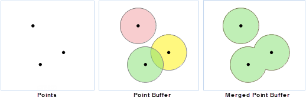
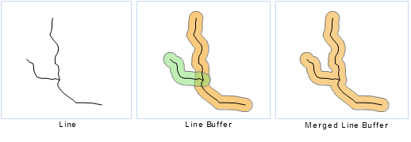
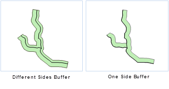

---
id: BufferTheory
title: Theory of Buffer Analysis  
---  
A buffer in GIS is a zone around a map feature measured in units of distance
or time. A buffer is useful for proximity analysis. A buffer is an area
defined by the bounding region determined by a set of points at a specified
maximum distance from all nodes along segments of an object. Buffer analysis
is used for identifying areas surrounding geographic features. The process
involves generating a buffer around existing geographic features and then
identifying or selecting features based on whether they fall inside or outside
the boundary of the buffer.

The basic buffer feature is point, line or polygon. Buffer analyst supports
point dataset, line dataset, polygon dataset (recordset) and network dataset.
The buffer analyst of the network dataset focuses on edges. Two types of
buffer analysis: single ring buffer and multiple ring buffer (analysis).
Following is the introduction of point, line and region buffer zone, which
takes the single ring buffer as an example.

  * **Point Buffer Zone**

The point buffer zone is a circular region that is generated by a specified
point object (the center of a circle) and a specified buffer distance (the
radius of a circle). If the buffer distance is large enough, the buffer zone
of two or more point objects may overlap. If you select Dissolve Buffers, the
overlapped part will be dissolved, the output buffer zone is a complex polygon
object.

  

  * **Line Buffer Zone**

The line buffer zone is an enclosed region formed by joining the two lines
that are generated by moving the specified line object a fixed distance on
both sides of it along the normal direction of the line object with the smooth
curves (or flat heads) at the endpoints of the two lines. Similarly, if the
buffer distance is large enough, the buffer zone of two or more line objects
may overlap. Its dissolved result is the same with dissolving the point buffer
zones.

  
 
  
When the buffer for line data is of a flat type, the buffer distance on the
two sides of the lines can be different. You can also create a buffer on
either side, as shown below:

  

  * **Polygon Buffer Zone**

It is similar to generate the polygon buffer zone. The difference is the
polygon buffer zone only extends or contracts on one side of the polygon
boundary. If the buffer radius is positive, the buffer zone extends outside
the boundary of the polygon object; and if the buffer radius is negative, the
buffer zone contracts inside the boundary of the polygon object. Similarly, if
the buffer distance is large enough, the buffer zone of two or more polygon
objects may overlap. Its dissolved result is the same with dissolving the
point buffer zones.

  
 
  * **Multi-ring Buffer Zone**

Multi-ring Buffer is to create multiple buffers around the geometry object
according to the several specified buffer radius. For the line object, you
also can create one-side multi buffer, but it doesn't support the creation of
the network dataset.

  

###  Related Topics

 [Create Single Buffer
Zone](../bufferanalyst/SingleBuffer)

 [Create Multi-
Buffer](../bufferanalyst/MutilBuffer)

 [Sample Application for Buffer
Analysis](BufferAnalyst_Example)

