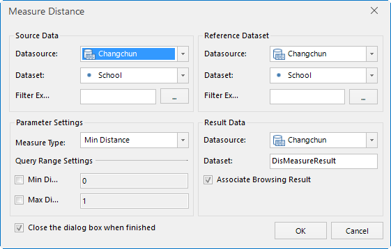
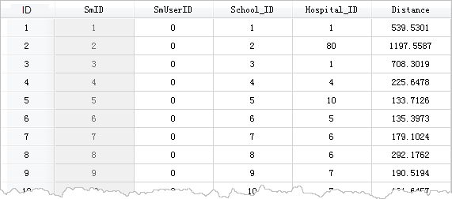
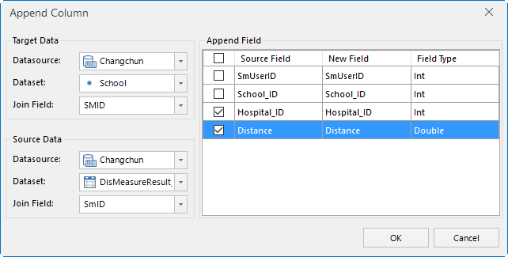
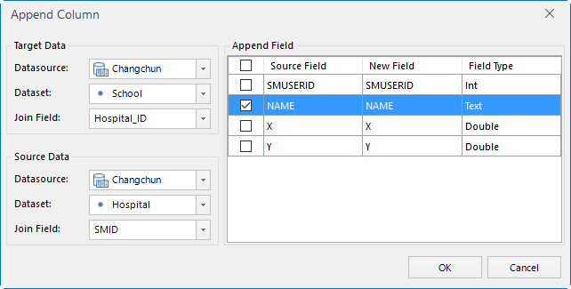
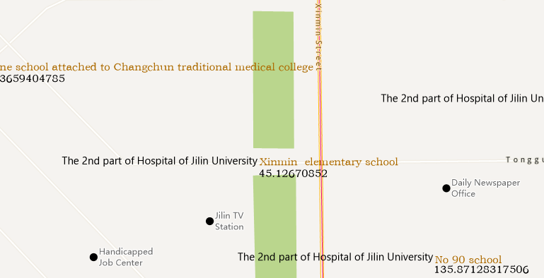

---
id: DistanceAnalyst_Example
title: Measure Distance Example  
---  
**Topic: Calculate hospitals nearest to schools in a city**

Data preparation: School and hospital data of a city

Basic Steps:

  1. Through Measure Distance, you can calculate hospitals nearest to schools. Specific operations are as follows:  

    

  2. The result is attribute table data, recording school ID, distance information and IDs of hospitals nearest to schools. Through Append Column, you can append Hospital_ID and Distance field information in the attribute table to the point dataset for schools.        
  3. According to the ID of hospitals, you can add corresponding hospitals to point dataset for schools. Specific parameters are as follows:     
  4. After the appending operation, there are hospital ID, names, distance information in the school point data. After creating label matrix map for the School dataset, hospitals and distance information to schools will be vividly displayed.     
###  Related Topics

 [Distance Calculation
Theory](DistanceMeasure_Theory)

 [Distance Calculation](DistanceMeasure)

