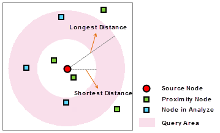
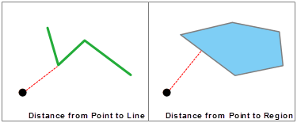
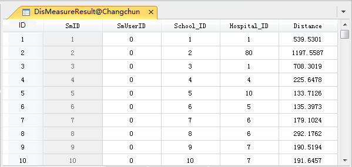

---
id: DistanceMeasure
title: Measure Distance  
---  
### Introduction

Calculates the distances between points and points/lines/regions, and the
distances from the points/lines/regions within certain extents to the
specified points. The result is saved in a new tabular dataset, with fields
for source point ID, close element ID(points/lines/regions), and their
distance.

### Application scenarios:

This function is used to check the proximity relationship between two groups
of features. For example, you can use it to find the closest stream for a set
of wildlife observations, or the closest bus stops to a set of tourist
destinations.

Another use scenario is: Find all the wells close to and its distances to the
polluted well within a specified extent.

### Function Entrances

  * Click **Spatial Analysis** > **Vector Analysis** > **Proximity Analysis** > **Measure Distance**.
  * **Toolbox** > **Vector Analysis** > **Proximity Analysis** > **Measure Distance**. (iDesktopX)

### Parameter Description

  * **Source Data** : 
    * **Datasource** : Select the datasource.
    * **Dataset** : Select the point dataset or network dataset whose nodes will be used to calculate distances.
    * **Filter** : Use expressions to specify the point data that will be used in the calculation. Please refer to [SQL Expression Dialog Box](../../../Query/SQLDia).
  * **Reference Data** : 
    * **Datasource** : Select the datasource.
    * **Dataset** : Select the point/line/region dataset or network dataset.
    * **Filter** : Use expressions to specify the point data that will be used in the calculation. Please refer to [SQL Expression Dialog Box](../../../Query/SQLDia).
  * **Measure Type** : Select the calculation mode. Either the closest distance (Min Distance) or distances within an extent. 
    * **Min Distance** : Within the specified query extent, the distance between the closest features from the reference dataset and each source point from the source dataset will be calculated and saved in a tabular dataset with the ID and distance values of the closest features. For the **Min Distance** , you can set the min distance and the max distance. Their units are the same as your dataset. And then, the objects whose distances to the source points are greater than the min distance and smaller than the max distance will involve in the calculation.
    * **Distance in Range** : Under this measure type, you can also set the query extent by setting the min and max distances, so only features from the reference dataset that fall within the range will be taken into account. 

  

  
**Note:**

* The distance from a point to a line is the shortest distance from the point to the whole line object (i.e., finds a nearest point on the line to the source point). Similarly, the distance from a point to a region is the minimum distance from the source point to the whole region object.   
  
    * The source and reference dataset must have the same coordinate system.
    * If two objects are (partly) overlapped, then the distance is 0. For example, if the point object is on the line object, then the distance between them is 0.
* Set the name of the result dataset and the datasource to save the dataset. 
    * **Datasource:** Set the datasource to save the dataset.
    * **Dataset:** Specify the name of the dataset to save the result to.
* **Associate browsing result:** When you check this option, the source and reference data will be display at the same time in the same map window and browsed in association with the result tabular dataset.
* **Close the dialog box when finished:** check this option so that the dialog box will be closed automatically after the operation is finished. 
* After setting all the parameters, click OK.

  

###  Related Topics

 [Theory on Distance
Calculation](DistanceMeasure_Theory)

 [Applications of Distance
Calculation](DistanceAnalyst_Example)

