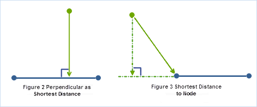

---
id: DistanceMeasure_Theory
title: Theory on Measure Distance  
---  
### Introduction

Calculates the distances between points and points/lines/regions, and the
distances from the points/lines/regions within certain extents to the
specified points. The result is saved in a new tabular dataset, with fields
for source point ID, close element ID(points/lines/regions), and their
distance. Note that:

  * The source and reference dataset must have the same coordinate system. The result distance is in the same unit with the dataset coordinate system.
  * There can be more than one reference features that are closest to a source point, in that case, all their IDs and distance will be recorded in the tabular dataset.
  * The distance will be considered as 0 if the source and reference features contain one another or overlap.
  * If the reference dataset is a region dataset, then the boundary of the region is used in the calculation. If the source point is within a region, then their distance is 0.

### Theory on Measure Distance

  1. **The distance between the source and reference point is the length of the straight line between the source and reference points.** To calculate the closest distance, it will calculate the distance from the source point to the reference features, and save the closest one or more features as the result.

  
  2. **Distance from a point to a line is either the perpendicular or the closest vertex.** The shortest distance from a point to a line segment is the perpendicular to the line segment. If a perpendicular cannot be drawn within the end vertices of the line segment, then the distance to the closest end vertex is the shortest distance. Distance between polylines is determined by segment vertices, as illustrated below.
  
  
  3. **Distance from a point to a line is either the perpendicular or the closest vertex.**

Because a polygon is an area enclosed by an ordered collection of line segments, calculating the distance from a point to a polygon involves identifying the closest line segment to the point, and then the above rule is applied to get the distance. The distance is positive only when the point is outside of the polygon; otherwise, it is zero.

  

###  Related Topics

 [Calculate Distances](DistanceMeasure)

 [Applications of Distance Calculation](DistanceAnalyst_Example)
