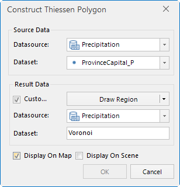
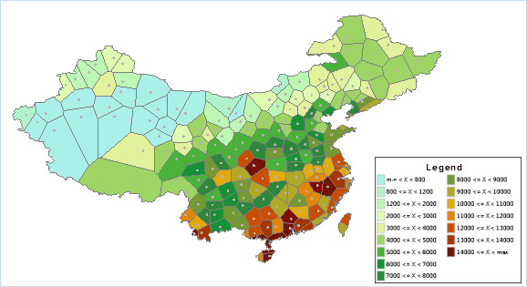

---
id: ThiessenAnalyst_Example
title: Applications of Constructing Thiessen Polygons  
---  
This application creates Thiessen polygons for meteorological stations in
China and then creates a Ranges Thematic map to show the ranges of average
precipitation for each polygon area.

Here are the steps:

  1. in the current workspace, open the sample datasource China400.udb, and create a new datasource. Name it, e.g. Thiessen.
  2. Import the Excel datasheet with all the national meteorological station data and import it to the Thiessen datasource. Convert the imported tabular dataset to a point dataset. 
  3. Create a new map window and add Provinces_R to the map window. Enable the layer to be editable. Select all the region features and group them into one using the Group function in the Object Operations tab.
  4. Click Spatial Analysis->Vector Analysis-> Proximity Analysis -> Thiessen Polygon, and open the dialog box.

  
  
  5. In the dialog box, select the station dataset as the source dataset, and specify the region in Provinces_R as the extent for analysis.
  6. Check the Display on Map option and show the result polygons in the current map window.
  7. Create a Ranges Thematic map for the Thiessen polygons. Use the annual precipitation field as the thematic field, and set the number of ranges to 15. The result map is shown below:

  

###  Related Topics

 [Constructing Thiessen
Polygons](ThiessenPolygon)

 [Theory on Constructing Thiessen
Polygons](ThiessenPolygon_Theory)

