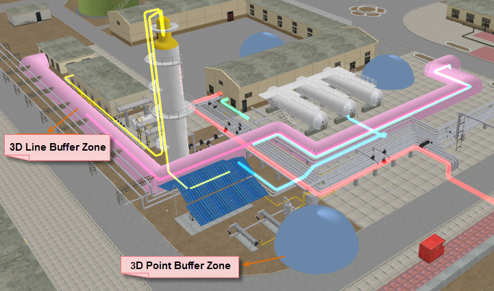

###  Introduction

A 3D buffer is either a globe generated for a 3D point or a cylinder for a 3D
line, of a certain radius.

  * Currently, 3D buffer can only be created for 3D point and line dataset. 
  * Parameters are set differently for 3D point and line datasets. For line datasets, the buffer zone can be a round end one or a flat end one. 

###  Application scenarios:

  * Calculate the potential risk range of explosives;
  * Calculate the coverage of internet hot pot;
  * Calculate the range of radiation source.

### Function Entrances

  * Click **Spatial Analysis** > **Vector Analysis** > **Buffer Zone** > **3D Buffer**.
  * **Toolbox** > **Vector Analysis** > **Buffer Zone** > **3D Buffer**. (iDesktopX)

### Parameter Description

* **Data Type**: Select the type of data to create buffer from. You can select either a 3D point or a 3D line dataset. For a 3D line dataset, you can set the buffer type: round or flat ends. Check the parameter explanation for the dialog box: 
* Set buffer data.
   * **Datasource** : Select the datasource that contains the data to create buffer from.
   * **Dataset** : Select the dataset to create buffer from.
   * **Selected objects only** : this option is available when objects are selected in the dataset; buffer will be created only for the selected objects. When this option is disabled, buffer will be created for all the objects in the dataset.
* **Buffer Type** : set the type of buffer to create:
   * **Round** : the buffer at the ends of the polyline will have a circular shape. This is the default option.
   * **Flat** : the buffer at the end of the polyline will be closed with a straight line passing through the start/end point of the polyline.
* Input a value in the "Buffer Radius" box to specify the buffer distance. The value is in Double with 10 decimal digits . Max value: 1.79769313486232E+308. Min value: -1.79769313486232E+308. Prompts will be given if the input value goes beyond the value range. 
* **Semicircle Line Segment (4-200):** This parameter defines the smoothness of the buffer border. Larger values mean more arcs created and more smooth in the border. The value should be between 4 to 200. By default, the value is 100. 
* **Display on Scene:** When this option is checked, the buffer will be displayed in the current scene. By default, this option is checked.
* Set the result data.
   * **Datasource:** The data source that the results of the buffers will be saved to.
   * **Dataset:** Specify the name of the dataset to save the buffers to.
* Click OK if all the parameters are set and create buffers.

  

###  Related Topics

 [About Buffer Analysis](HowBufferWork)

 [Create Buffer](SingleBuffer)

 [Create Multi-Buffer](MutilBuffer)

