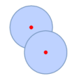
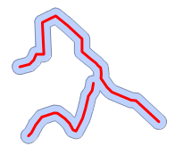
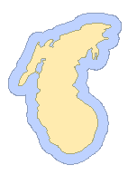
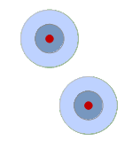
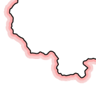
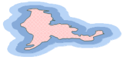

Buffer Analysis is a basic GIS spatial operation. It automatically builds
zones with a certain width around point, line, or region geometric objects
according to a specified buffer distance. For example, in an environmental
protection project, a zone can be drawn to include areas within a certain
distance of a polluted river to represent the contamination area; a zone with
a certain size can be drawn around an airport to define a non-residential area
for public health concerns.

The user can use the " **Buffer** " button or the " **Multi-buffer** " button
in the application program to build buffer(s) with a specific buffer distance
for one or more geometric objects.

Buffer Analysis can be applied to a point dataset, a line dataset, or a region
dataset, to build buffers for all objects or selected objects in the dataset.

1. Single-buffer
2. Multi-buffer

### Single-buffer

UpDownType | Illustration | Description  
---|---|---  
Point Buffer Analysis |  | Builds buffer s for point objects. For example, buffers can be built for two radio broadcasting stations to analyze the residential area that can be covered by the signal transmitted from each of the two stations as well as the area covered by signals from both stations.  
Line Buffer Analysis |  | Builds buffers for line objects. For example, suppose two adjacent streets are to be expanded by 20 meters. A buffer analysis combined with a general query analysis can identify the buildings that need to be pulled down before expanding the streets. Region Buffer Analysis |  | Builds buffers for region objects. For example, buffers can be built for rivers and lakes to identify areas vulnerable to floods.  
  
### Multi-buffer

UpDownType | Illustration | Description  
---|---|---  
Point Multi-buffer Analysis |  | Builds multi-buffers for point objects. For example, zones with different radii can be created around a pollution source to represent the diffusion process of the pollutant.  
Line Multi-buffer Analysis |  | Builds multi-buffers for line objects. For example, a one-sided multi-buffer can be created for the border line of a country to produce a hatching effect.  
Region Multi-buffer Analysis |  | Builds multi-buffers for region objects. For example, a buffer analysis can be applied to a desert in our country to create a multi-buffer with distances of 20 km and 50 km, to provide basic information for analyzing the distribution of desert expansion and to assist with desertification controlling.  
  
### Related Topics

[Generating a Single Buffer](SingleBuffer)

[Generating Multiple Buffers](MutilBuffer)
