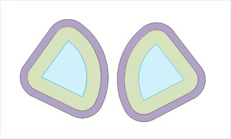

---
id: MutilBuffer
title: Generating Multiple Buffers  
---  
### Instructions

A multi-buffer analysis is a process of creating multiple buffers with
specific distances around geometric objects. The resulted buffer can be
utilized in further analyses.

  * Currently, the application program does not support generating multi-buffers for CAD datasets or network datasets.
  * When building multi-buffers for line datasets, both round buffers and flat buffers can be created; whereas only round buffers can be created for point/region datasets by default.

### Function Entrances

  * Click **Spatial Analysis** > **Vector Analysis** > **Buffer Zone** > **Multi-buffer Zone**.
  * **Toolbox** > **Vector Analysis** > **Buffer Zone** > **Multi-buffer Zone**. (iDesktopX)

### Parameter Description

* **Buffer data**
  - **Datasource** : Select the datasource that contains the dataset for which buffer zones are to be generated.
  - **Dataset** : The system supports generating multi-buffers for point, line, and region data. Thus in the "Dataset" drop-down list, all the point, line, and region datasets in the datasource are shown. Select one dataset from the list for the multi-buffer analysis.
  - **Selected objects only** : If there are point, line, or region objects selected in the current map window, the "Selected objects only" check box can be checked. If it is, multi-buffers will be created only for the selected objects, in which case the datasource and the dataset for the buffer analysis cannot be specified; if it is unchecked, multi-buffers will be created for all the objects in the dataset, and the datasource and the dataset for the analysis can be changed.
* Set the buffer radius for the multi-buffer in the Radius List. Buffer radii can be set using the Batch Add, Insert, and Delete buttons in the toolbar. In the Radius List, the buffer radii arranged in a sequence correspond to zones in the multi-buffer. A buffer radius can be changed by clicking on the corresponding number in the "Radius" column.
  - **Batch Add:** Click on the icon button in the toolbar to open the **Batch Add** dialog box. Buffer radius values in a descending order can be set in this dialog box. Buffer zones are created for the object to be buffered according to different buffer radii. By default, a multi-buffer is generated with radii ranging from 10 meters to 30 meters and a 10-meter interval. The added buffer radius values will be displayed in order in the Radius List.
      * **Start Value** : Set the radius of the innermost buffer.
      * **End Value** : Set the radius of the outermost buffer.
      * **Step** : Set the interval between adjacent levels of buffer zones, i.e., the difference in the buffer radii.
      * **Count** : Set the count of buffer levels of the multi-buffer.
      * **Update end value** : If this check box is checked, the system will automatically calculate the radius of the outermost buffer for the multi-buffer according to the input start value, step, and count. If it is unchecked, the system will take the input end value as the radius of the outermost buffer.
  - **Insert** : Select one or more buffer radii and click the button to add a buffer radius in front of the selected buffer radius (radii). The default inserted value is 10.

* **Unit** : Buffer radius unit options include: Millimeters, Centimeters, Decimeters, Meters, Kilometers, Inches, Feet, Miles, Degrees, and Yards.
* Set the buffer type for the multi-buffers. If the multi-buffers are to be created for line objects, the parameters in the Buffer Type box are selectable. The buffer type can be set for the multi-buffers for line objects.
   - **Round** : When generating a multi-buffer, two parallel lines are drawn at a certain distance of the line object, one on each side. A half-circle, with the buffer distance as its radius, is drawn to connect the same-side ends of the two parallel lines to form a buffer. Round is the default buffer type.
   - **Flat** : When generating a multi-buffer, a rectangular buffer is formed by taking the line segment connecting adjacent nodes of a line object as one side and the left or right radius as the other. One-sided flat multi-buffers can be created for a line dataset.
     * **Left Radius** : Create a multi-buffer on the left side of a line according to buffer radii.
     * **Right Radius** : Create a multi-buffer on the right side of a line according to buffer radii.
* **Result Data** : In the "Result" box, it can be set whether the generated multi-buffer is merged, whether to retain the field attributes of the original objects, whether to add the buffer in the current window, and the number of semicircle segments.
   - **Union Buffer** : If this option is checked, a Union operation will be performed on the generated buffers to result one single buffer. If it is unchecked, the multiple buffers will be retained in the result and no union operation is to be performed.
 

   - **Keep Attributes** : If this option is checked, the non-system field information for the original object will be reserved for the corresponding buffers. If it is unchecked, the non-system field information for the original objects will be lost. The option is checked by default. Note: When "Union buffer zones" is checked, this option is not applicable.
   - **Create Ring-buffer** : If this option is checked, the outer buffer is single to the inner buffer. If it is not checked, the outer buffer covers the inner buffer. It is checked by default.
   - **Display In Map** : If this option is checked, the generated multi-buffers will be added in the current map window. If it is not checked, the buffer analysis result will not be added in the window. It is checked by default.
   - **Semicircle Segments** : This parameter is used to set the smoothness of the buffer boundaries in the result. The greater this value is, the more circle segments there will be, and the smoother the buffer boundaries will be. The value range is from 4 to 200. The default value is 100.

* Set result data. 
  - **Datasource:** Select the datasource for saving the resulted multi-buffers here.
  - **Dataset:** Input the name of the dataset which the generated multi-buffers are saved in. If the dataset with the input name already exists, the user will be prompted that the name was illegal and a new input is needed.

### Related Topics

[Introduction to Buffer Analysis](HowBufferWork)

[Generating a Single Buffer](SingleBuffer)
