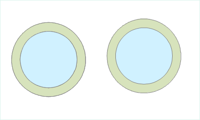

---
id: SingleBuffer
title: Generating a Single Buffer  
---  
### Instructions

A single-buffer is a polygon with a certain width automatically created around
a point, line, or region entity. The resulted buffer can be utilized in
further analyses.

  * Currently, buffer analysis can be applied to only point, line, and region datasets. Buffers cannot be created for CAD datasets, network datasets, or route datasets.
  * Parameter settings for buffer analyses on different types of data are different. When generating buffers for line data, either the round or the flat type can be chosen; when creating buffers for point or region data, only the round type can be chosen. A flat buffer can be unsymmetrical, with its right radius and left radius unequal, or with only one side.
  * When specifying the buffer distance with numeric values, negative values can be applied only to region datasets, and positive values must be assigned for point or line datasets. A buffer distance of 0 is not valid for any types of datasets.
  * When specifying the buffer distance with a field, if a field value is null or 0, no buffer will be generated for the corresponding object. Negative values in the specified field will be taken as positive values when dataset in the analysis is a point or line dataset. When generating flat buffers for line data, if a negative value is assigned to the left (right) radius, the absolute value will be used. When buffers are generated for a region dataset, a negative distance value will be used as it is.

### Function Entrances

  * Click **Spatial Analysis** > **Vector Analysis** > **Buffer Zone** > **Buffer Zone**.
  * **Toolbox** > **Vector Analysis** > **Buffer Zone** > **Buffer Zone**. (iDesktopX)

### Parameter Description

* **Data Type** : Select the type of the data which needs to generate buffer.

Buffers can be created for point/region datasets or line datasets. The buffer
type, either round or flat, must be set when generating buffers for line data,
whereas it does not need to be set for point or region data. That is why more
options are there in the Create Buffer dialog box when the buffer is created
for a line dataset. Below are the explanations about parameters in the dialog
box when generating buffers for line data.

* **Buffer Data**: The system will automatically filter the datasets and pick out the line datasets contained in the selected datasource, according to the type of the data for the buffer analysis. If buffers are to be created for point/region data, only the point/region datasets under the corresponding datasource will be displayed.
  - **Datasource**: Select the datasource that contains the dataset for which buffers are to be generated.
   - **Dataset**: Select the dataset for which buffers are to be created.
   - **Selected objects only**: If there are objects selected in a dataset, the "Selected objects only" check box can be checked, checking it means buffers will be created only for the selected objects, in which case the datasource and the dataset for the buffer analysis cannot be specified; if it is unchecked, buffers will be created for all the objects in the dataset, and the datasource and the dataset for the analysis can be changed.

* Set the buffer type. Different parameters need to be set for different buffer types.
   - **Round**: Two parallel lines are drawn at a certain distance of a line object, one on each side. A half-circle, with the buffer distance as its radius, is drawn to connect the same-side ends of the two parallel lines to form a buffer. Round is the default buffer type.
   - **Flat**: When generating a buffer, a rectangular buffer is formed by taking the line segment connecting adjacent nodes of a line object as one side and the left or right radius as the other.
      * **Left**: Create buffers on the left side of lines.
      * **Right**: Create buffers on the right side of lines.

Two-sided buffers will be generated only when "Left" and "Right" are both checked. By default, both left buffers and right buffers are generated.

* Set the buffer unit: Units of the buffer distance can be one of the following: Millimeters, Centimeters, Decimeters, Meters, Kilometers, Inches, Feet, Miles, Degrees, and Yards.
* Set the mode for specifying the buffer distance.
   * **Numeric** : If "Numeric" is checked, the buffer distance is set by inputting a number. The input value is a number with 10 decimal digits and a double precision. The maximum value is 1.79769313486232E+308, and the minimum is -1.79769313486232E+308. If the input value is not within that range, the user will be prompted that the number of digits has exceeded the valid range.
     * **Left Radius** : Input the left radius value in the text box to the right of the "Left Radius" tag.
     * **Right Radius** : Input the right radius value in the text box to the right of the "Right Radius" tag.

   * **Field:** If "Field" is checked, the buffer distance will be specified using a numeric field or expression.
     * **Left Radius** : Click on the drop-down arrow next to it, and select a numeric field or "Expression" to assign the values of a numeric field or an expression to the left buffer distances for generating buffers. For usage of SQL expressions, please refer to: ["SQL Expression" Dialog Box](../../../Query/SQLDia).
     * **Right Radius:** Click on the drop-down arrow next to it, and select a numeric field or "Expression" to assign the values of a numeric field or an expression to the right buffer distances for generating buffers. For usage of SQL expressions, please refer to: ["SQL Expression" Dialog Box](../../../Query/SQLDia).
* Set the result options. It can be set whether to merge the generated multiple buffers, whether to retain the field attributes of the original objects, whether to add the buffers into the current window, and the number of semicircle segments.
   * **Union Buffer** : If this option is checked, a Union operation will be performed on the generated buffers to result one single buffer. If it is unchecked, generated buffers will remain unchanged in the result and no union operation is to be performed.
 
**Keep attributes** : If this option is checked, the non-system field information for the original object will be reserved for the corresponding buffers. If it is unchecked, the non-system field information for the original objects will be lost. The option is checked by default. Note: When "Union buffer zones" is checked, this option is not applicable.
**Show result in map** : If this option is checked, the generated buffers will be added in the current map window. If it is not checked, the buffer analysis result will not be added in the window. It is checked by default.
**Semicircle Segments** : This parameter is used to set the smoothness of the buffer boundaries in the result. The greater this value is, the more circle segments there will be, and the smoother the buffer boundaries will be. The value range is from 4 to 200. The default value is 100.

* Set the result data.
  * **Datasource** : Select the datasource for saving the resulted buffers.
  * **Dataset** : Input the name of the dataset which the generated buffers are to be saved in. If the dataset with the input name already exists, the user will be prompted that the name was illegal and a new input is needed.

### Remarks

For radius, there are numeric and field.

* **Numeric**
  * Point and line data isn't allowed the negative radius.
* **Field**
  * This way is only for datasets and recordsets. The field shouldn't be the system field.
  * For point and line, if the field value is negative, the system will get its absolute value.
  * When the buffer radius is the field or expression, for the region dataset, if merge the buffer, it is the absolute value; if not, it is processed according to the negative radius.
  * When the buffer radius is the field expression, only valid for buffer analysis of datasets. That is, when the option of "Selected Objects Only" is selected, the "Expression ..." in Buffer Radius set to "Field" is not supported for analysis and the analysis fails.

### Related topics

[Introduction to Buffer Analysis](HowBufferWork)

[Generating Multiple Buffers](MutilBuffer)
