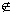
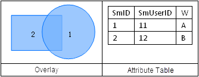

---
id: AboutOverlay
title: Introduction to Overlay Analysis  
---  
An overlay analysis is a process of generating new spatial information for
users through processing or analyzing spatial data. For example, if we were to
understand the soil distribution for a specific administrative region, we
could perform an overlay analysis on the national soil map dataset and the
administrative district map dataset and get the desirable result. Overlay
analyses can also be used to process various attribute information for
datasets.

Overlay analyses are widely applied in domains such as resource management,
urban development assessment, land management, agriculture, forestry and
animal husbandry, statistics, etc.

Spatial overlay analyses may involve logical operations such as And, Or, Not,
and XOR. The table below describes the properties and rules of Boolean logical
operations on layers. For simplicity, layers A, B, and C in a Euclidean space
are defined to be binary images here.

Logical Operation | Definition | Properties | Description  
---|---|---|---  
**Contain** |  If x∈A and x∈B, then A is a sub-image of B or B contains A, denoted as A⊆B.  | (1)A⊆A   (2)A⊆B,B⊆C⇒A⊆C   (3)A⊆B,B⊆A⇒A=B | If A⊆B and A≠B, then A is a real sub-image of B, i.e., A⊂B. O is used to denote an image, and f an empty image.  
**Intersection** |  The intersection of A and B is defined as: AnB={x\|x∈A and x∈B} | (1)A∩A=A    (2)A∩φ=φ   (3)(A∩B)∩C=A∩(B∩C) | If AnB=φ, then A and B do not intersect.  
**Union (Or)** |  The union (Or) of A and B is defined as: A∪B={x\|x∈A or x∈B} | (1)A∪A=A    (2)A∪φ=A    (3)(A∪B)∪C=A∪(B∪C) 
**Poor** |  The difference between A and B is defined as: A-B={x\|x∈A, and xB}  | (1)A-φ=A    (2)A-A=φ    (3)(A-B)-C=A-(B∪C) 
**Logical Exclusive XOR** |  Logical Exclusive XOR. The XOR of A and B is defined as: A⊕B={x\|x∈A or x∈B, and xA∩B} |  |  
  
The figure below is an illustration of Boolean logical operations including Contain, Intersect, Union, Difference, and XOR.

### Instructions

A region dataset participating in an overlay analysis cannot have overlapped region objects. A dataset with overlapped region objects is invalid, and overlay analysis result generated from it may be erroneous. It is recommended to verify the topology of a dataset before using it in an overlay analysis.

Below is an example of overlapped regions:

###  Note

  1. Overlay analyses can be performed on point/line/region objects. There are input dataset(in SuperMap GIS, it is called the 1st dataset) and overlay dataset(in SuperMap GIS, it is called the 2nd dataset). 
  2. Note that the analysis may error if the region dataset or selections have overlayed parts itself.. 
  3. The input and overlay datasets must have the same coordinate system. 
  4. It is advised to build a spatial index on the result dataset if the data size is large, to increase the display efficiency of data. 

### Related Topics

[Overlay Analysis Operators](Overlayoperation)

[Clip](Clipbutton)

[Union](Unionbutton)

[Erase](Erasebutton)

[Intersect](Intersectbutton)

[Identity](Identitybutton)

[XOR](XORbutton)

[Update](Updatebutton)
