---
id: Overlayoperation
title: Overlay Analysis Operators  
---  
SuperMap currently provides 7 overlay analysis operators. Below are the descriptions of them:

## Clip

Clip is a process of extracting a set of features from a clipped dataset using
a clip dataset. The set of polygons in the clip dataset define the clipping
region. The features or feature parts that fall outside of these polygons are
to be erased, and the ones that fall within the polygons will be output to the
result dataset.

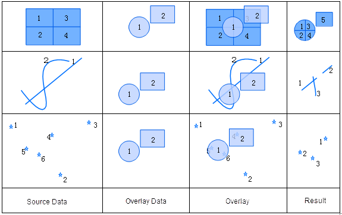  
  
  
The attribute table of the output result of a Clip operation comes from the
attribute table of the clipped dataset. The attribute table structure is the
same with that of the clipped dataset. Only fields such as area, perimeter,
and length need to be recalculated. All the other field values in the clipped
dataset A are retained in the output. As demonstrated in the figure below, all
the fields in dataset A are added automatically.

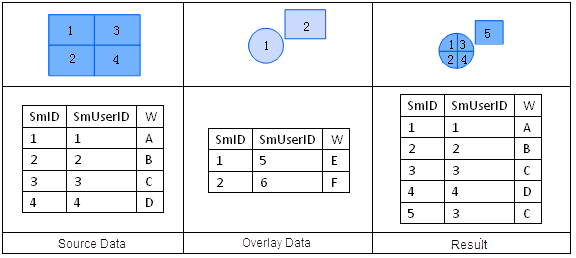  

  
## Union

Union is an operation that finds the union of two datasets. After a union
operation, the polygons are split where the two region datasets intersect.
Topology is rebuilt, and the geometric and attribute information for the two
datasets are all output to the result dataset.

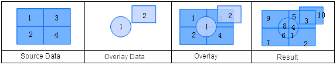  

  
The attribute table of the output result of a union operation comes from the
attribute tables of both input datasets. During a union operation, the user
can select attribute fields that need to be reserved from the attribute tables
of dataset A and B.

The fields in the overlay analysis result are named as "FieldName_1" and
"FieldName_2" here, as shown in the figure below.

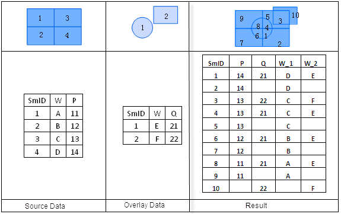  

  
## Erase

Erase is a process of erasing polygon parts in an erased dataset where it
overlaps with the erase dataset. The set of polygons in the erase dataset
define the erasing region. The features or feature parts that fall within
these polygons are to be erased, and the ones that fall outside of the
polygons will be output to the result dataset. The Erase operation works
similarly to the Clip operation. The only difference is that the content
reserved in the result is different.

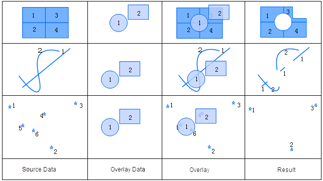  
 
  
The attribute table of the output result of an Erase operation comes from the
attribute table of the erased dataset. The attribute table types are the same.
As demonstrated in the figure below, all the non-system fields in dataset A
are added automatically.

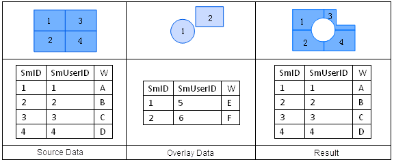  

  
## Intersect

An Intersect operation finds the intersection of two datasets. The feature
objects (except point objects) in the intersected dataset are split where they
intersect with the polygons in the intersect dataset. The spatial information
for a result dataset from an Intersect operation is the same with that from a
Clip operation. But the clip operation does not process attribute information,
whereas an Intersect operation allows the user to select attribute fields to
be reserved.

  

  
The attribute table of the output result of an Intersect operation contains
its own attribute fields, and all attribute fields of the intersected dataset
and the intersect dataset. The user can select attribute fields need to be
reserved from the attribute tables of dataset A and B.

  
 
  
## Identity

The result dataset has the same extent as the source dataset layer, but it
contains geometric shapes and attributes data from the overlay dataset layer.
An Identity operation is a process of performing an Intersect operation on the
source dataset and the overlay dataset and then a Union operation on the
intersection result and the source dataset. If the first dataset is a point
dataset, all the objects in the first dataset will be retained in the newly
generated dataset; if the first dataset is a line dataset, all the objects in
the first dataset will also be retained in the newly generated dataset, but
the objects in the second dataset are split where the two datasets intersect;
if the first dataset is a region dataset, all the source dataset's polygons
that lie within the controlling boundary will be retained in the result
dataset, and the objects in the second dataset are split where the two
datasets intersect.

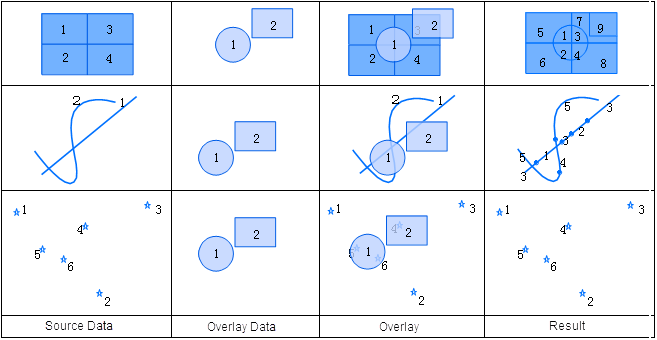  
 
  
The attribute fields, except for the system fields, of the output result of an
Identity operation comes from the attribute fields of both input datasets. The
user can select attribute fields that need to be reserved from the attribute
tables of the source dataset and the overlay dataset, as shown below.

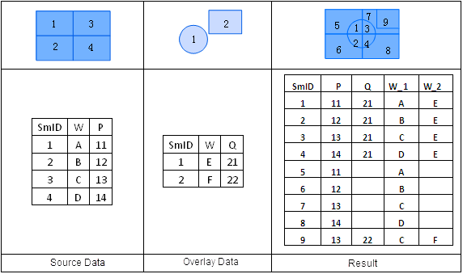  

  
## XOR

The symmetry difference analysis on two region datasets. For each region
object, the operation erases the part that overlaps with geometric objects in
the other dataset, and then the rest part of the object is reserved.

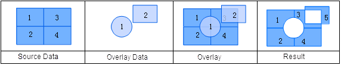  

  
The attribute table of an XOR operation output contains the non-system fields
of the two input datasets, as shown in the figure below:

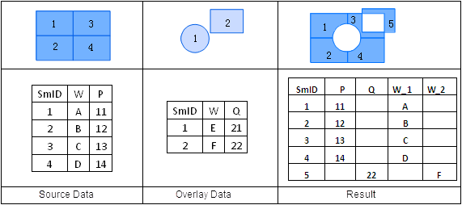  
 
  
## Update

Update is a process of replacing object parts in an updated dataset with
corresponding parts in an update dataset where the two datasets overlap. It is
an erasing process followed by a pasting process. The geometric shapes and
attribute information in the update dataset are reserved in the result
dataset.

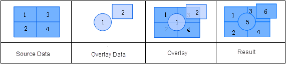  

  
The attribute table of an Update operation output is shown in the following
figure. The attribute values of the geometric object parts where dataset A and
B overlap are updated with the corresponding attribute values in dataset B.

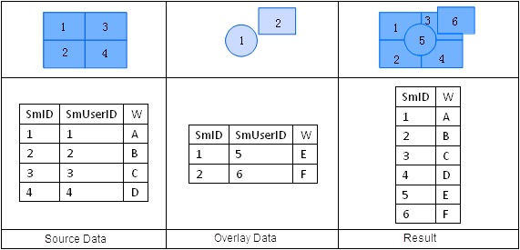  

