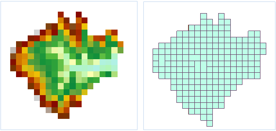

### Introduction

Vectorize the raster data and it can convert the raster dataset into point,
line and region datasets.

Open the Terrain datasource in the folder
SampleData/ExerciseData/RasterAnalysis, which has a resolution of 5 meters of
DEM data, we use this data as an example.

### Functional Entrances

  * Click **Spatial Analysis** > **Raster Analysis** > **Vector Converter** > **Raster to Vector**.
  * **Toolbox** > **Raster Analysis** > **Vector Converter** > **Raster to Vector**. (iDesktopX)

### Parameter Description

  * Specify the source data. 
    * Datasource: select datasource that the raster dataset to vectorize belongs to.
    * Dataset: select the dataset to vectorize.
  * The created result dataset position and name after set vectorization in "Result Data" area. 
    * Datasource: Select the datasource that the result dataset belongs to.
    * Type: Select the vectorization dataset types, which can be point datasets, line datasets or region datasets.
    * Dataset: Name the result dataset created by vectoring.
  * The parameter of "Vector Line Setting" area is available when the "Dataset Type" of result data is set to "Line Dataset". 
    * Smooth Method: It is supported only when the grid converts into vector line data. SuperMap provides two methods to smooth, "B Spline" and POLISH. If you want to know more about smooth process, please refer to [Introduction of Smooth Method](../../DataProcessing/Vector/SmoothMeth). 
    * Smoothness: It is valid when the raster converted into vector line data and the "Smooth Method" isn't "Don't smooth". The effective value is related to the smooth method. When the method is B Spline and the coefficient is smaller than 2, it won't be smooth. When use the POLISH, it is valid that the coefficient is set to greater than 1. The larger the smooth coefficient is, the result line smoother.
    * Refine Raster before Conversation: Select this item to refine the raster data before vectorization. Refinement can decrease the cell quantity of identification line objects in raster data, which improves the speed and precision of vectorization.

The effect of refinement: For example, there are may 5,6 cells on a scanning
contour map to display the width of a contour line. After the refinement, the
width of contour line may be displayed with a cell. You can also refine the
raster and image data first, and then vectorize. Please refer to [Raster
Refining](ThinRaster) for mmore information.

  * The parameter of "Grid Settings" area is only valid when the raster dataset is vectorization. It is invalid when image dataset is vectorization. 
    * NoValue: For the Raster Dataset, the cell that the call value is set to this value is regarded as no value and don't attend the vectorization.
    * NoValue Tolerance: Set this "NoValue tolerance" after set the no data value. The cell value in "Novalue Data" and tolerance range both don't attend the data cell of vectorization. 
    * Grid Value Field: It is used to store Cell Value of every cell to the field of result dataset. The name of raster field is specified in the text frame. The default field name is value.
    * Convert Specified Value Only: Only vectorized the region that the grid value is equal to the set value. 
      * Grid Value: The cell that the value is the set value attends the vectorization. 
      * Grid Value Tolerance: Set the tolerance range of this specified "Cell Value". The specified "Cell Value" and the Cell Value in the range of float tolerance attend the vectorization. 
  * The parameter of "Image Settings" area is only valid when the image dataset is vectorization. It is invalid when grid dataset is vectorization. 
    * Background: For the image dataset, if happened to the cell of this color, take it as the background color and don't attend the vectorization. 
    * Back Tolerance: If the image dataset choose the background color and the cell RGB in dataset is in the background float tolerance range, this cell is also regarded as background color. The tolerance corresponds to 3 value of RGB. For example, if the tolerance is 10, the color (R?0, B?0, G?0 ) are in its tolerance range. The tolerance value range is (0-255). 
  * **Environment Settings** : set the analysis parameters as needed. For detail operations, please refer to [Setting the Analysis Environment](../Raster/AnalystEnvironment). 

Note: you are allowed to specify the environment parameters as global
variables, then you do not need to set the parameters again in other
operations. Also the system can read parameter values specified in the raster
analysis environment if you do not set parameters here.

  

