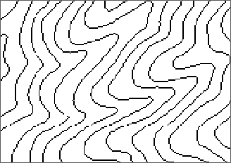
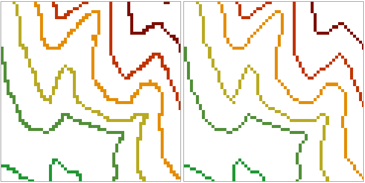

### Function instruction

Thin Raster is used for preprocessing raster data to improve the speed and
precision of vectorization. It is available for converting raster or image
data to lines.

Thin raster can reduce the number of cells identifying the linear feature,
thus improve the speed and precision of vectorization. It is commonly used
before converting raster to vector line data to make the converting effect
better. For example, a scanned contour map (image data) may use 5 or 6 cells
to represent the width of a contour, after the thin operation, the width of
the contour is display with only one cell.  

  
   
### Functional Entrances

  * Click **Spatial Analysis** > **Raster Analysis** > **Vector Converter** > **Thin Raster**.
  * **Toolbox** > **Raster Analysis** > **Vector Converter** > **Thin Raster**. (iDesktopX)

### Parameter Description

  * **Source Data** : Specify the datasource that contains the raster dataset you want and the dataset.
  * Set the parameters for thin raster. 
  * **NoValue** : For different types of data selected, NoValue has different meaning.
    * **Raster Data** : The value for the cells in the result dataset whose value is null, that is assign the value null after thin raster to -9999. The cells set as NoValue will no be used in the thin raster calculation; When multiple cells represent a line is represented by one cell after thin raster, the other cells will be filled with NoValue. Users can click the  button to pick up the value of the opened raster dataset, or input a raster value of the opened raster dataset.
    * **Image Data** : The specified image data pixel is as no value. The cell with novalue will not be processed in the thin raster process. The default of novalue is related to pixel format: The default of novalue corresponds to the maximum of the data range. For example, the pixel format of image data is 24-bit true color. The dataset can be represented as 0-16777215. The default value is 16777215. Users can click the  button tp pick up the value of the opened raster dataset, or input a raster value of the opened raster dataset.

  * **Tolerance** : Set the tolerance of the background, if the ignore background color is (r, g, b), and the tolerance is a, the color range to ignore will be (r-a, g-a, b-a) to (r+a, g+a, b+a).
* **Result Data** : Set the result data parameter. Select the datasource and input the name of the result dataset.

### Application

Open the Terrain datasource in the folder SampleData/ExerciseData/RasterAnalysis where RasterForLine data is rasterized by contour lines. After settings corresponding parameters, we can get the following result.

  
  
###  Notes

  * Novalue tolerance is the tolerance of Novalue specified by users. It is none of business with original Novelus in cell.
  * It is recommanded to click the **Pick Up** button to pick up the value of the opened raster dataset. If the entered NoValue does't exist, the results are't correct, or raster data failed to thin.
