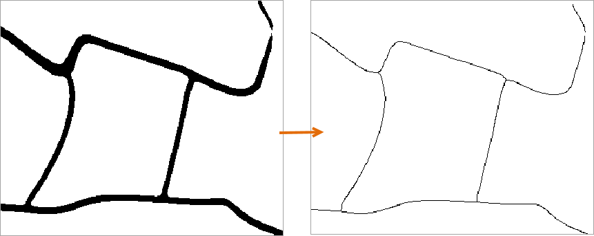

### Function instructions

Binary Thin Raster is a method to process binary images. Non-binary images
will be processed first to be binary images. But you are required to specify a
NoValue. After that, the feature will thin values except for NoValues. The
feature can work both on raster data and image data.

The feature Binary Thin Raster has much higher efficiency in image or raster
data processing than the feature Thin Raster.

### Function entrances

  * Click on the **Spatial Analysis** tab > **Raster Analysis** group > **Vector Converter** > **Binary Thin Raster**.
  * **Toolbox** > **Raster Analysis** > **Vector Converter** > **Binary Thin Raster**. (iDesktopX)

### Parameter description

In the Binary Thin Raster dialog box, set parameters like source data, NoValue, Tolerance and so on. For more detail information, please refer to [Thin Raster](ThinRaster)

**Save as a raster dataset** : If source data is image data, checking the checkbox can generate data resulting in a raster dataset.

### Sample application

Given road data of an area. To improve the speed and precision of image vectorization, we can use the feature Binary Thin Raster to reduce the number of pixels that are used to identify roads in road raster data. After the operation, we can get data like the following right picture shows.

  
  
### Notes

  * The Tolerance you set in the dialog box works only on the NoValue pixels you specified. 
  * To make sure the NoValue setting correct and the operation can run successfully, please pick up the value of NoValue (enable the feature Pick Up by clicking on the button ).
