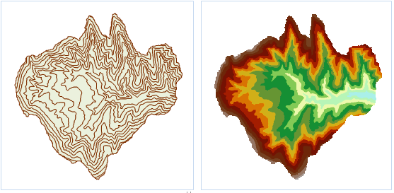

### Introduction

Convert a vector dataset to a grid dataset.

Open the Terrain datasource in the folder SampleData/ExerciseData/RasterAnalysis, which has a resolution of 5 meters of DEM data, we use this data as an example.

### Functional Entrances

  * Click **Spatial Analysis** > **Raster Analysis** > **Vector Converter** > **Vector to Raster**.
  * **Toolbox** > **Raster Analysis** > **Vector Converter** > **Vector to Raster**. (iDesktopX)

### Parameter Description

  * Source Data
    * Datasource: List all the datasources in current workspace and select the datasource that the vector dataset needs to rasterize belongs to.
    * Dataset: List all the vector datasets in the selected datasource. Select the vector dataset to be rasterized. Here it will locate to the selected dataset in the workspace manager automatically.
    * Field: List all the field names in the source dataset, and select a field as the pixel value of result dataset. Notes: the field range should match the pixel type, namely, the grid field range should be in the store scope of result dataset pixel type. Once the field exceeds the range, the corresponding pixel grid value is processed to 0. For example, when the pixel type is set to "4 bits", the store range is [0,15], a total of 16 integer. If a field is 20 (exceeds "4 bits" pixel format), the pixel grid value corresponded to the field is 0.
  * Result Data
    * Datasource: List all the datasources in current workspace and select the datasource that contains the result datasets. It is the same with source datasource by default.
    * Dataset: Set the name of result dataset and the result dtaset is the grid dataset (GRID).
  * Parameter Settings
    * Boundary Datasource: List all the datasources in current workspace and select the datasource that the boundary dataset belongs to.
    * Boundary Dataset: Select the boundary dataset and it should be the region dataset. You can rasterize the intersection of source dataset and boundary dataset. 
    * Take the selected region object as boundary: Take the range of selected region object as boundary and rasterize the selected source dataset. After selected a or more region objects in the map window, open the "vector to raster" dialog box, it will check the "Select Region as Boundary" check box automatically. The rasterization range is the union of the selected region in the map window. The boundary datasource and dataset in the right parameter setting area will locate to the dataset that the selected region dataset belongs to, and the two are unchangeable. If you didn't select the region before rasterization, this function is unavailable.
    * Pixel Format: Set the pixel format of the result dataset, including: 1 bit, 4 bit, single byte, double byte, integer, Long, single-precision and double-precision. Users can select the appropriate pixel format to operate according to the actual needs. See [Pixel Format of Grid Dataset](PixelFormat) for more information about pixel format.
    * Resolution: Set the resolution of grid dataset. The calculation formula of default resolution is L/500. L represents the boundary length, namely, it is the largest Width and Height value in result dataset. 500 represents the default cell number that the boundary L has and the calculation result is the pixel size. Besides, Users can adjust the result dataset resolution. The unit of resolution is the same as geographical unit of source dataset.
  * **Environment Settings** : set the analysis parameters. For detail operations, please refer to [Setting the Analysis Environment](../Raster/AnalystEnvironment). 

Note: you are allowed to specify the environment parameters as global variables, then you do not need to set the parameters again in other operations. Also the system can read parameter values specified in the raster analysis environment if you do not set parameters here.

  
