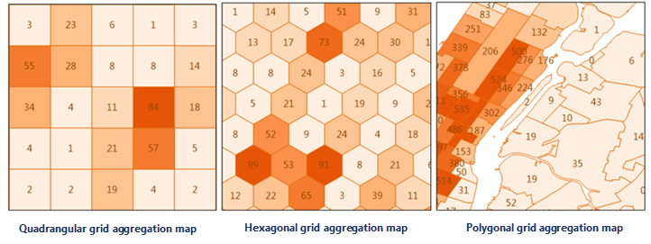

The Point Aggregation Analysis function refers to creating an aggregation map
based on a point dataset. First, it will classify points with grids or
polygons, then count the number of points falling into each polygon or grid as
the statistical value of each polygon, or using the weighted values of points
in each polygon as the statistical value. At last fill in the polygons or
grids with color gradients.

The Point Aggregation Analysis methods contain: Grid Aggregation, Polygon
Aggregation, of which, the shape of grids could be quadrangles or hexagons.

###  Sample Applications

  * Analyzing impacts that the terrorism events have had on each area based on the global terrorism data, such as, how many people were injured, how many events in an area, and so on.
  * Analyzing how natural disasters like earthquakes, debris flows, etc. affect every area.

### Functional Entrances

  * Click Online > Analysis > Aggregate Points.

###  Instructions

1. **iServer Address** : Set an address to log in iServer service. For specific, please refer to [Data Input](DataInputType).
2. **Source Data** : Specify your point dataset for the aggregation analysis by choosing it from the drop-down list. For specific, please refer to [Data Input](DataInputType).
3. **Analysis Bounds** : Optional. Points falling into the specified bounds will involve in the analysis. The whole bounds of the source data is by default. You can enter the bounds directly or copy and paste bounds. 
4. **Analysis parameter settings**
  * **Aggregation Type** : 
    * Polygon Aggregation: According to boundaries of polygons, calculates the number of point features within each polygon. Hence, you have to specify a region dataset.
    * Grid Region Aggregation: Given a size for each gird, divides the analysis range into lots of quadrangles or hexagons, and then summarizes the number of points within each grid. And so you need to set following parameters.
  * **Aggregation Type** : Set the shape of each grid to a quadrangle or a hexagon.
  * **Analysis Bounds** : specify which points to be processed, the default is all points. The parameter is not required. If you want to set the parameter, you could enter a range directly like -74.050,40.650,-73.850,40.850 with the order is left, bottom, right, top separated by commas or paste a rage.
  * **Mesh Size** : required. For the quadrangle, it is the edge length; for the hexagon, it is the distance from the vertex to the center of the hexagon. The default value is 10.  
  * **Mesh Size Unit** : Optional: Meter, Kilometer, Yard, Foot, Mile (default is Meter).
  * **Weight Field** : Fields that representing weight values of points to be analyzed. If you specify more than one fields, the formats should be like col7,col8. 
    * You can specify multiple weight fields separated with commas as performing multiple analysis operations on points and each time it corresponds to a different weight value.
    * If this parameter is null, 1 will be taken as the weight value.
    * Whether the parameter is set or not, the situation that the weight value is 1 will be analyzed, that is using the number of the points as the statistics value of the region. The result is saved in a field of the attribute table of the result dataset.
    * The statistic mode is required to set once this field is set and the two have the one-to-one relationship.
  * **Statistic Mode** : It is optional. The supportive modes include: max, min, average, sum, variance, stdDeviation.The number of statistic modes are the same with the number of weight fields.
5. After all required parameters are set, you can perform the analysis, and the result will be opened automatically and its path will be output in the Output window.

###  Related topics

 [Environment configuration](BigDataAnalysisEnvironmentConfiguration)

 [Data Preparation](DataPreparation)
