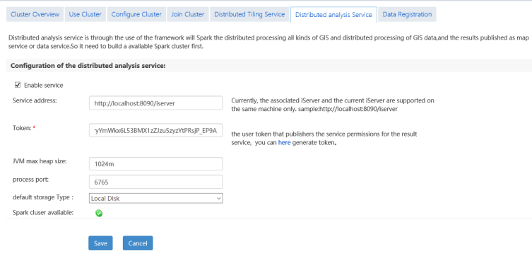

The new module Big Data Analysis performs online analysis effectively on a
huge amount of data or data with a lot of objects. Big data online analysis
relies on iServer service. Based on Spark computing platform, distributed
storage of data which is stored in HDFS, iServer DataStore, or UDB can be
analyzed. The features including big data of management, analysis, mapping and
outputting map have been provided by iDesktop. For online analysis function,
there are some features to be provided, including: simple point density
analysis, kernel density analysis, vector clip analysis, single object query,
mesh aggregation analysis, polygon aggregation analysis, range summary
analysis.

Follwing details environment configuration and operation of Big data online
analysis.

  * Analysis service environment configuration
  * Preparing data
  * Big data online analysis

### Big data online analysis service configuration

Before performing big data online analysis, if there is no available analysis
environment and data, you need to configure iServer service environment and
data. The detail operation in Windows is as follow:

  1. Start iServer service.
  2. First access <http://localhost:8090/iserver/>. Create manager account, and then click System environment > Check License > Configure sample service. After that, click Next.

  3. Click Service Manager address in Configure Completely page, and then select Clusters option after login. In the Use Cluster page, check Enable the cluster and select a cluster service. 

  4. Switch to Configure Cluster panel, check Enable The Distributed Computing Cluster and select Enable local Spark cluster service (default), finally click Save.
  5. Redirect to Join Cluster panel, click Edit located in Cluster address list to modify the default address "anotherclusterservice" to native ip. After that, check Enable distributed analyst node and Enable reporter, and click Save.

  6. Head to "Distributed analysis Service" panel, then check "Enable service" and set corresponding parameters. Finally click "Save" button.

  7. Succeed to configure environment, and then register data in iServer and you can execute online analysis. For data registration, please refer to [Register Data](DataPreparation).

###  Related topics

 [Data Preparation](DataPreparation)

 [Density Analysis](DensityAnalysis)

