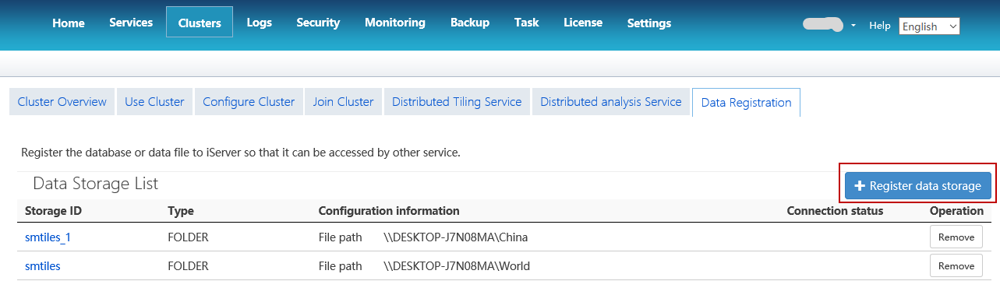
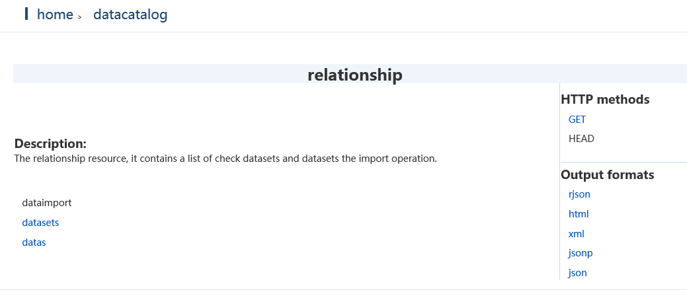

### Connect iServer service

To perform online analysis successfully, you are required to start the iServer
service first and ensure that the service can be used normally. iDesktop will
record all service addresses that have been connected successfully. You can
choose the one you need from iServer URL drop-down list, and then iDesktop
will connect the service automatically, or you can create a new connection.

  * iServer URL: specify the IP address of the started iServer service like: 192.168.58.1:8090.
  * Username/password: specify the username and password of iServer manager.

### Input data

Methods for inputting data to perform online analysis contain: HDFS, iServer
Catalog. About how to prepare data, please refer to [Data
preparation](DataPreparation).

**HDFS**

If you want to use data in HDFS, set Input Type to HDFS and click on Browse
button to open the Select File dialog box, in which, you are required to enter
a HDFS data address and then choose csv files as needed from the file list.

  1. A variety of data can be saved in HDFS like points, lines, polygons and so on, however, only point data can be analyzed by iServer currently. 
  2. There must be a meta file corresponding to the csv file which will participate in the analysis. And so, when the prompt dialog box pops up to tell you there is not a meta file, please click on the "OK" button to create one. 

**iServer Catalog**

You can set Input Type to iServer Catalog, and then in the Dataset drop-down
list, all datasets which can be used for online analysis will be listed.  
You are allowed to register and import new data through two ways: Register
Data, Import Data for online analysis.

1. **Register Data** : Click on the button to head to the iServer data registration page where you can register data. New registered data will be managed under the sharefile resource. About how to register data, please refer to [data preparation](DataPreparation).  
2. **Import Data** : Click on this button to head to the iServer datacatalog relationship page where you import data. Note: To import data successfully, you need to configure iServer Datastore into the current iServer service.  
  * Under the relationship / dataimport resource, you can upload datasets. The supported file types include: UDB datasource, CSV file, workspace, Excel file, and GeoJson file, and the udb datasource and workspace need to be compressed to * .zip format.
  * Uploaded datasets can be found in the list under relationship/datasets resource.
3. You can choose a dataset from the Dataset drop-down list where data input successfully are shown in.

