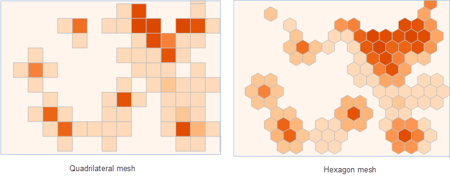
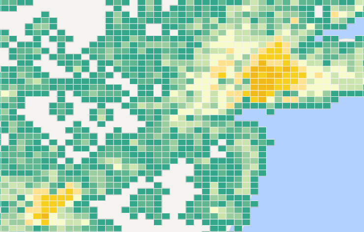

There are two kinds of Density analysis supported by big data distribution
analysis service: Simple Density Analysis and kernel density analysis.

  * **Simple density analysis** : Used to calculate magnitude-per-unit area within a specified neighborhood around each point. Calculation method is point measure value is divided by a specified neighborhood area, where the neighborhood is overlay, the density value also is added, density of every output raster is the sum of all neighborhood density value overlaying in grid. The unit of result raster value is reciprocal of the original dataset square, such as: if original dataset unit is meter, the unit of result dataset will be per square meter. 
  * **Kernel density analysis** : Used to calculate unit density of point or line features measure value within a specified range. It can visually reflect the distribution of discrete measurements in continuous surfaces. It can be used to: calculate population density, calculate building density, get crime situation report, monitor population density in tourist area, analyze operation situation of retail store chain and so on.

###  Applications

  * Analyzing the density of terrorist attacks in various regions of the world.
  * Analyzing traffic volume based on GPS data. 

###  Function Entrances

  * Click the Online tab > Analysis group > Density Analysis.

###  Basic steps

1. **iServer Address** : choose an address for iserver login. For specific instructions, please refer to [data input](DataInputType).
2. **Source Data** : specify the dataset which will be used for the analysis. Click on the drop-down button and select a line dataset or a region dataset from the drop-down list. All of datasets in the drop-down list All of datasets in the drop-down list are filtered out for the analysis.
3. **Analysis Bounds** : The points outside the analysis range will not participate the calculation. The default is full range of input data.
4. **Analysis parameter settings** :
  * **Analysis Method** : Specifies the method as needed. Two methods are provided: simple density analysis or kernel density analysis.
  * **Mesh Type** : Specifies a shape for each grid cell: quadrilateral or hexagonal.  
  * **Weight Field** : Specifies a set of field name where weight value of point to be analyzed is located. Format is such as: col7,col8. Optional parameter. **Remarks** : You can pass multiple field indexes which indicates weight and are separated by commas. If the parameter is null, the point weight is 1. Whether the parameter is set or not, it will be analyzed that the weight value is 1. The results are reflected in the attribute table field of the result dataset.
  * **Mesh Size** : For quadrilateral grid, it is the side length; for hexagonal grid, it is the distance from vertex of the hexagon to the center point. (Default value is 10.)  
  * **Mesh Size Unit** : The optional units include: Meter, Kilometer, Yard, Foot, Mile (Meter is by default)
  * **Radius** : The searching radius for calculating density. Default value is 100
  * **Radius Unit** : Can select: Meter, Kilometer, Yard, Foot, Mile (Default value is Meter)
  * **Area Unit** : Can select: SquareMeter, SquareKiloMeter, Hectare, Are, Acre, SquareFoot, SquareYard, SquareMile (Default value is SquareMile)
5. **Thematic Parameters**
  * **Interval Mode** : Specify how to organize your data. Several classification modes are provided including: Equidistant Interval, Logarithmic Interval, Quantile Interval, Square Root Interval, Standard Deviation Interval.
  * **Number of Segments** : Specify how many classes the feature values will be divided into.
  * **Color Gradient Mode** : Set a color gradient mode. The provided modes contain: green-orange-purple gradient, green-orange gradient, rainbow color, spectral gradient, terrain gradient.
6. **Analysis result** : Click OK to perform the analysis, and the result will be opened automatically on the map window and its path will be output in the output window. **Note** : If you fail to open the data directly by clicking the path in the output window, please copy and paste the resulting data to another folder and open it again. 

Following picture is the kernel analysis result to American transaction amount.

###  Related topics

 [Environment Configuration](BigDataAnalysisEnvironmentConfiguration)

 [Data Preparation](DataPreparation)
