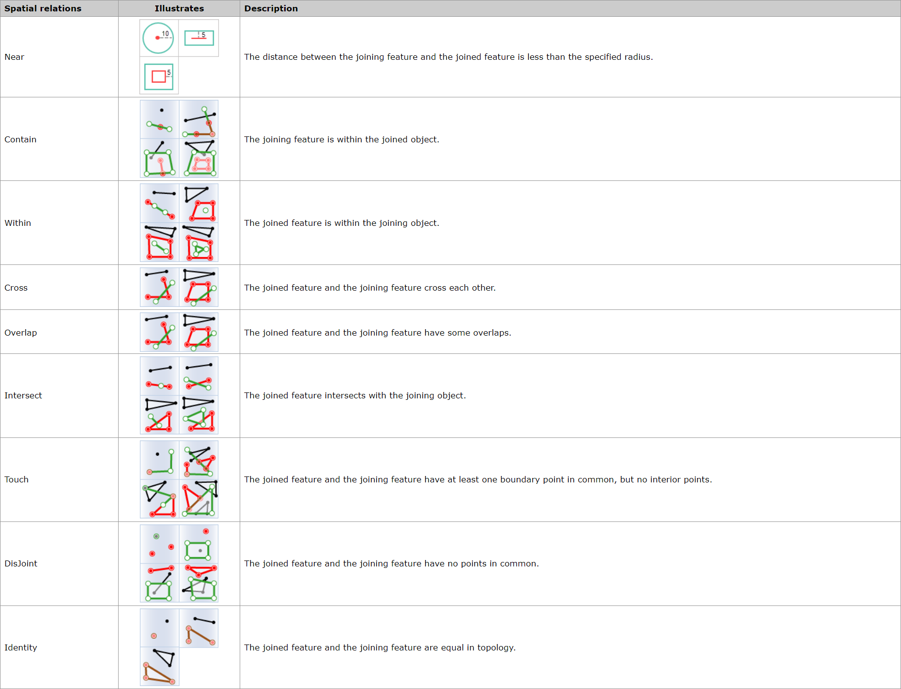
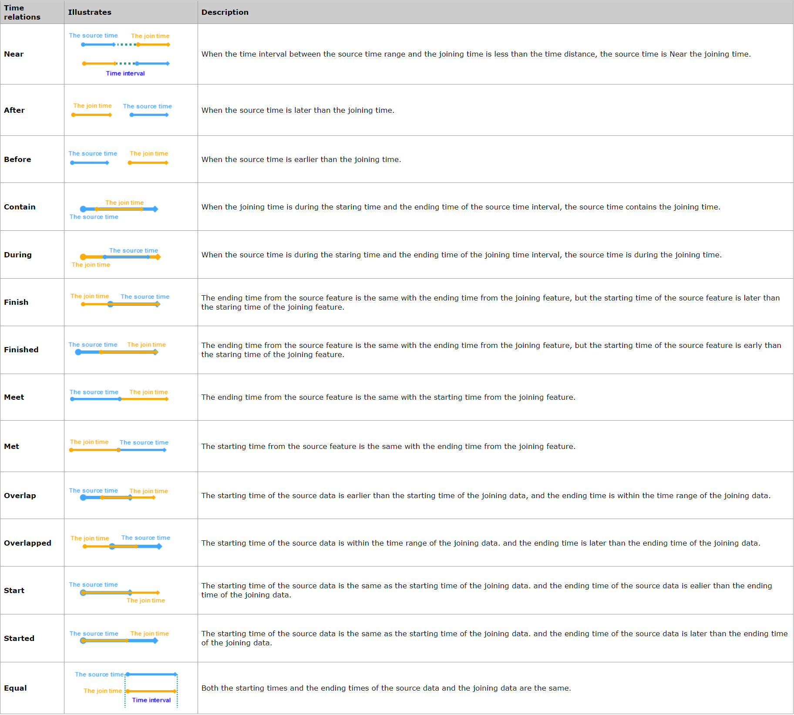
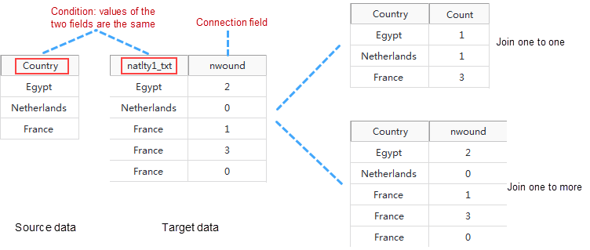

Joins attributes from one dataset into another dataset based on the spatial,
time or attribute relationship. The datasets involved could be spatial data or
attribute data. According to the specified conditions, iDesktop will determine
condition-meeting features and then join them into the target dataset.

The tool Feature Join can append information from one layer to another layer
based on spatial, time, or attribute relationship or a group of the three
relationships.

**Spatial relations**

First, determines the spatial relationship between features. The available
spatial relations depend on the joined layer type (point, line, or region).
For specific spatial relation instructions, see [Basic Spatial Query
Operators](../Query/SQ_BasicOperators).

  
**Time relations**

  
###  Applications

  * Analyze the flow of funds transactions and count the sum of the amounts remitted to the same account within the specified time.
  * With the tool, additional information of various jurisdictions (such as school districts, police districts, communities, etc.) can be added to each crime to further study and analyze the impact of crime on different jurisdictions.

###  Function Entrance

  * Click the Online tab > Analysis group > Join Features.

###  Basic steps

1. **iServer Address** : choose an address for iserver login. For specific instructions, please refer to [data input](DataInputType).
2. **Source Data** : specify the dataset which will be used for the funtion. How details on how to set the source data, please refer to [Data Input](DataInputType).
3. **Join Data** : Required. Specify the dataset which will provide attributes. The supported data type can be point, line or region.
4. **Analysis parameter settings** : 
  * **Join Type** : Required. Specify the correspondence between the joined feature (the source object) and then joining object. 
    * **Join one to one** : If there is only one joining feature meeting the condition, only the attribute value of the feature will be updated to the source object. But if there are more than one joining geatures meeting condition, apart from the number of joining features relative to each joined feature will be recorded in the result, their attributes will be appended into corresponding source data based on the specified statistical pattern.
    * **Join one to many** : Saves attributes of all joining features matching the specified conditions into result. As the following pictures show, there are three field values France in target data are matched with the one in source data, and so all of the three joining field values are kept in result data. 
  * **Property Statistics Field** : Calculates statistics for all field values meeting conditions. If you specify multiple fields, the same number of property statistical methods should be specified as well.
  * **Property Statistical Methods** : Select one operate for calculating statistics for statistical fields.
  * **Tolerance** : The parameter only works on the spatial distance in the spatial relation "Near", for example, if the spatial distance is 100 meters, and the tolerance is 1, then joining objects which are 99 meters or 100 meters distance from the source objects match the condition.
5. **Connection Field** : Specify the field of the join data which will be appended to the source data. You can specify more than one fields split by commas.
  * **Spatial Feature Join** : The selection of spatial relations is dependent on the geometrical type (point, line, region) of layers involved in the analysis.
  * **Time Feature Join** : The selection of time relations is dependent on the time type (moment or interval) of layers involved in the analysis.
  * **Property Feature Join** : Determines attribute relations between joined features and joining features, such as whether a field value from the joined feature is equal or unequal to the corresponding field value of the joining feature, and then appends the field value matching the condition.
  * **Time Distance Unit** : Second is by default.
6. Click OK to perform the feature, and the result will be opened automatically on the map window and its path will be output in the output window.

###  Related topics

 [Environment Configuration](BigDataAnalysisEnvironmentConfiguration)

 [Data Preparation](DataPreparation)
