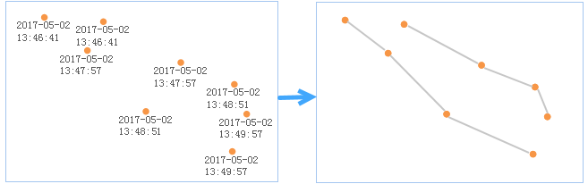
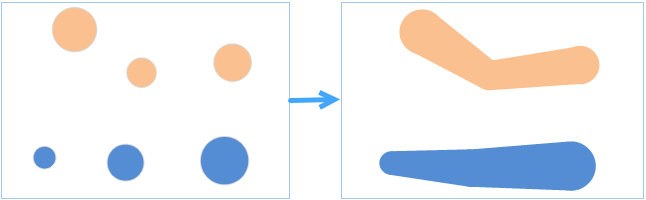
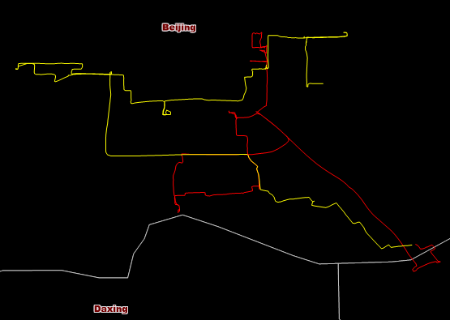

Connects all positions of target features at continuous times together to a
group of tracks resulting in a line or region dataset.

The type of result data is dependent on the type of input data.

* If the source data is a series of points, the result track data is a series of lines by jointing adjacent points.

* If the source data is a series of polygons, the result track data is a series of polygons by calculating minimum bounds of source polygons.

###  Applications

* A car uploads its position into a server via GPS every once for a while, and so GPS data of the car will be saved in the server, with the tool and the data, driving tracks of the car can be reconstructed, hence, the driving status of the car can be viewed more intuitively. 
* With the tool, tracks of a typhoon can be reconstructed for analyzing which area is affected.

###  Function Entrance

* Click the Online tab > Analysis group > Reconstruct Tracks Analysis.

###  Basic steps

1. **iServer Address** : choose an address for iserver login. For specific instructions, please refer to [data input](DataInputType).
2. **Source Data** : Specify the dataset which records the positions of the target features at continuous times. For specific instructions on setting source data, please refer to [Data Input](DataInputType).
3. **Analysis parameter settings** : 
  * **Time Property Field** : Required. Specify the field recording time. **Note** : Only a date type field can be set.
  * **Reconstruct ID Field** : Required. Tracks of target objects are identified by ID values, that is the target objects with the same ID value will be jointed to a track. If you set multiple fields, the filed values must be the same separately for connecting a track.
  * **Time Interval** : Required. The parameter is for dividing the tracks with equal IDs. For example, the time interval is 60 seconds, if the time interval of two adjacent input features with the same ID is greater than 60 seconds, there are no tracks to be constructed between the two features, otherwise, a track will be constructed between the two input features. 0 is by fault, meaning the result will not be divided by time.
  * **Time Interval Unit** : Required. Specify a unit for the time interval. 
  * **Property Statistics Field** : Set one or more attribute fields of the input dataset.
  * **Property Statistics Methods** : Select one operate for calculating statistics for statistical fields. The same number of property statistical methods should be specified.
4. Click OK to perform the analysis, and the result will be opened automatically on the map window and its path will be output in the output window. 

The two lines in the following picture are tracks of two taxis:

### Related topics

 [Environment Configuration](BigDataAnalysisEnvironmentConfiguration)

 [Data Preparation](DataPreparation)

