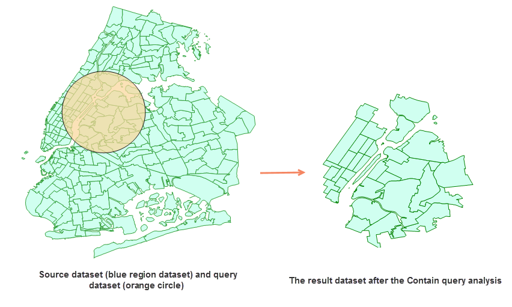

The spatial query is one kind of searching way which can construct filter
conditions based on the spatial positions between geometrical objects.

iDesktop provides several relation operations. For specific instructions, see
[Basic Spatial Query Operators](../Query/SQ_BasicOperators).

The single object spatial query in distributed analysis services refers to
perform spatial query on a source dataset with only one object from the query
dataset. If there are multiple objects in the query dataset, the object with
the minimum SmID value will be used as the single object.

###  Function Entrance

* Click the Online tab > Analysis group > Overlay Analysis.

###  Basic steps

1. **iServer Address** : choose an address for iserver login. For specific instructions, please refer to [data input](DataInputType).
2. **Source Data** : Specify the dataset which records the positions of the target features at continuous times. For specific instructions on setting source data, please refer to [Data Input](DataInputType).
3. **Query Data** : Required. Refers to the dataset where the query object is located. Only the single object query is supported. If there are multiple objects in the query dataset, the object with the smallest SmID will be used as the single object.
4. **Analysis Parameters** : Different spatial query modes have different requirements for the type of source and query datasets.
  * Identity, Disjoint, Contain, Intersect, Touch, Within: both of the source dataset type and the query dataset type could be point, line, or region.
  * Cross: The source dataset type must be line and the query-object dataset type can be line or region. 
  * Overlap: The source dataset type could line or region and must be the same with the query-object dataset type.
5. Click OK to perform the analysis, and the result will be opened automatically on the map window and its path will be output in the output window.

### Related topics

 [Environment Configuration](BigDataAnalysisEnvironmentConfiguration)

 [Data Preparation](DataPreparation)
