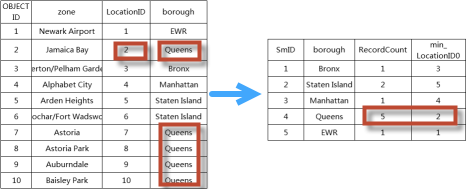

Summarizes field values of all fields of the input dataset as a certain
statistical method like maximum, minimum, average and so on.

In this analysis, you are required to specify a group field, an attribute
field and a statistical mode. For example, in the following tables, the number
of the field value Queens is 5 which is obtained by grouping the field
borough, of which, the minimum LocationID value is 2.

###  Function Entrance

  * Click the Online tab > Analysis group > Summarize Attributes.

###  Basic steps

1. **iServer Address** : choose an address for iserver login. For specific instructions, please refer to [data input](DataInputType).
2. **Source Data** : Specify the dataset which records the positions of the target features at continuous times. For specific instructions on setting source data, please refer to [Data Input](DataInputType).
3. **Analysis parameter settings** : 
  * **Group Field** : Optional. You can set multiple grouping fields separated by commas. The program will summarize values of the specified fields of all objects.
  * **Attribute Field** : Optional. Specify a field which is a numerical non-system field to participate in the statistical operation.
  * **Statistic Mode** : Optional. Specify which operation will be used to calculate statistics for the specified fields. Served operations include: max, min, average, sum, variance, stdDeviation (that is standard deviation), and the number of each group of attribute values will be recorded.
4. The analysis result is an attribute table, and the result path will be output in the Output Window.

###  Related topics

 [Environment Configuration](BigDataAnalysisEnvironmentConfiguration)

 [Data Preparation](DataPreparation)
