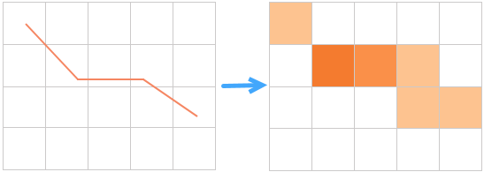
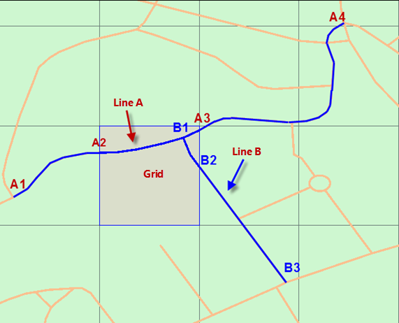
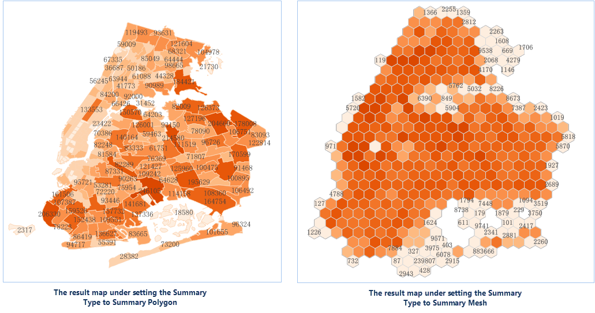

Uses grids or polygons to divide line/region features on a map, and then
calculates statistics for line/region features falling within each grid or
polygon based on a standard attribute field or a weight field, and results
will be as statistics values of each grid/polygon. Finally, sorts the
grids/polygons according to their statistics values, and fills them with
gradient colors.

Except the Summarize Region Analysis works on lines or polygons and the
Aggregate Points works on points, they have the similar concepts.

**Summarizing modes**

Two methods are provided for calculating statistics for lines or regions
falling into or intersecting with each grid. In the following picture,
quadrangular grids are adopted for the Summarize Region Analysis. There are
two lines (A, B) intersecting with the highlighted grid, and we can see that
the line A is from A1 to A4 but only the part of from A2 to A4 is within the
grid and the line B is from B1 to B3 but only the part of from B1 to B2 is
within the grid. Specify that the statistic field is "length" and the
statistic mode is "sum". And now taking the calculation of the statistical
value of the grid as an example to explain the two methods.

* **Calculate by a Standard Attribute Field**

It means calculating the length of lines A and B by using their original field
values.

  1. The value of field length of line A (that is from A1 to A4) is 364.11. 
  2. The value of field length of line A (that is from B1 to B4) is 165.01.
  3. The statistical value of the highlighted grid is: 364.11+165.01=529.12.

* **Calculate by a Weight Field**

Only the total length of lines falling within the highlighted grid will be calculated, and their attributes are calculated out by weighting the values of the standard field.
  1. The program will intercept the line A at points A2 and A3, and calculate the proportion of the A2A3 part in the entire line A, and then get the attribute value of A2A3 is 79.70.
  2. The program will intercept the line B at the point B2, and calculate the proportion of the B1B2 part in the entire line B, and then get the attribute value of B1B2 is 31.72
  3. The statistical value of the highlighted grid is: 79.70+31.72=111.42.

###  Application scenarios

* Calculates the total length of expressways within each county in an area 
* A city wants to arrange people to maintain streetlights. The analysis can be used to count the number of streetlights in each area so that proper numbers of people can be arranged.

###  Function Entrance

* Click the Online tab > Analysis group > Region Summary Analysis.

###  Basic steps

1. **iServer Address** : choose an address for iserver login. For specific instructions, please refer to [data input](DataInputType).
2. **Source Data** : Specify your dataset (which only can be a region dataset or a line dataset) for the analysis by choosing it from the drop-down list. 
3. **Analysis Bounds** : specify a range and then the input features falling into the range will take part in the analysis, the default is all features. The parameter is not required. If you want to set the parameter, you could enter a range directly like -74.050,40.650,-73.850,40.850 with the order is left, bottom, right, top separated by commas or paste a range.
4. **Analysis parameter settings** : 
  * **Summary Type** : required. 
    * Summary Polygon: According to boundaries of polygons, summarizes specific information of features within each polygon. Hence, you have to specify a region dataset.
    * Summary Mesh: Given a size for each gird, divides the analysis range into lots of quadrangles or hexagons, and then summarizes the specific information of features within each grid. And so you need to set following parameters.
  * **Mesh Type** : Set the shape of each grid to a quadrangle or a hexagon.
  * **Mesh Size** : required. For the quadrangle, it is the edge length; for the hexagon, it is the distance from the vertex to the center of the hexagon. The default value is 10.
  * **Mesh Size Unit** : Optional: Meter, Kilometer, Yard, Foot, Mile (default is Meter).
5. **Calculate by a Standard Field** : Calculates statistics to the original field values of the input features intersecting with each grid.
  * **Field Name** : Specify a field whose values will be used in the calculation.
  * **Static Mode** : Specify which operation will be adopted.
6. **Calculate by a Weight Field** : Calculate statistics to the attribute information (which can be obtained by weighting the standard field values) of lines or regions falling into each grid.
  * **Field Name** : Specify a field whose values will be weighted.
  * **Static Mode** : Specify which operation will be adopted.
7. **Lengths or areas included in the calculation** : Checking it means lengths (if the input features are lines) or areas (if the input features are regions) of input features will involve in the calculation.
  * **Thematic parameters**
    * **Precision** : Specify how many digits after the decimal point of each label value in the result label thematic map. For example, if you set the parameter to 1, each label value has one digit after the decimal point.
    * **Interval Mode** : Specify how to classify the statistical values. You could choose one as needed from the provided modes including: Equidistant Interval, Logarithmic Interval, Quantile Interval, Square Root Interval, Standard Deviation Interval.
    * **Number of Segments** : How many classes the statistical values will be classified.
    * **Color Gradient Mode** : Choose a color gradient for the result thematic map from the provided modes (including: green-orange-purple gradient, green-orange-red gradient, rainbow colors, spectral gradient, terrain gradient).
8. Click OK to perform the analysis, and the result will be opened automatically on the map window and its path will be output in the output window. 

Following pictures show the total lengths of expressways within each town in an area.

###  Related topics

 [Environment configuration](BigDataAnalysisEnvironmentConfiguration)

 [Data Preparation](DataPreparation)
