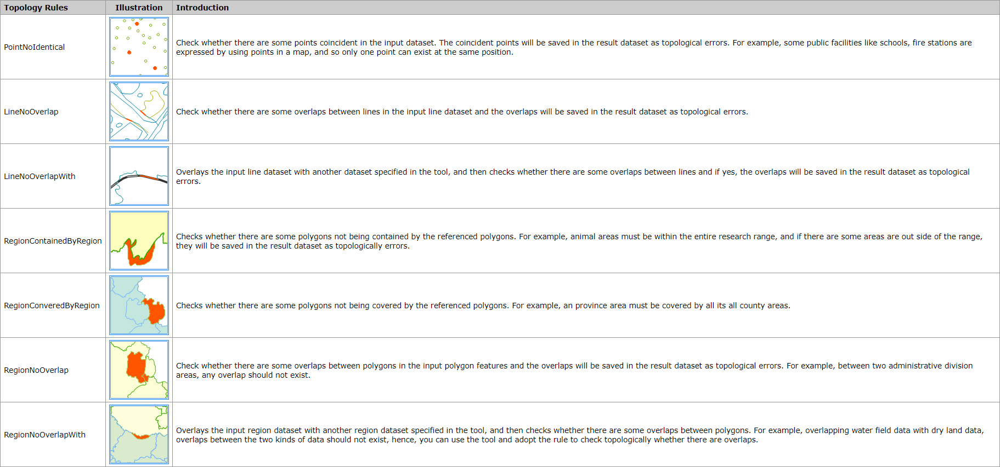

Checks your points, lines or polygons as corresponding topological rules and
then return the objects that do not match the selected topological rules. 7
topological rules are provided by SuperMap.

 
  
###  Function Entrance

* Click Online tab > Analysis group > Check Topology.

###  Basic steps

1. **iServer Address** : choose an address for iserver login. For specific instructions, please refer to [data input](DataInputType).
2. **Source Data** : Specify the dataset which will be checked topologically. What types of datasets are shown in the drop-down list depends on the topological rules. For specific instructions on setting source data, please refer to [Data Input](DataInputType).
3. **Analysis parameter settings** : 
  * **Topology Rules** : Required. Choose one rule from the drop-down list as needed.
  * **Dataset** : When you set the Topology Rules to RegionNoOverlapWith, RegionConveredByRegion, RegionContainedByRegion, or LineNoOverlapWith, you need to specify another dataset to check the source dataset topologically.
  * **Tolerance** : Optional. Set a tolerance for the analysis, and its unit is the same with the unit of the source dataset. The value must be equal to or greater than 0 and 0.000001 is by default.
4. Click OK to perform the analysis, and the result will be opened automatically on the map window and its path will be output in the output window.

###  Related topics

 [Environment configuration](BigDataAnalysisEnvironmentConfiguration)

 [Data Preparation](DataPreparation)
