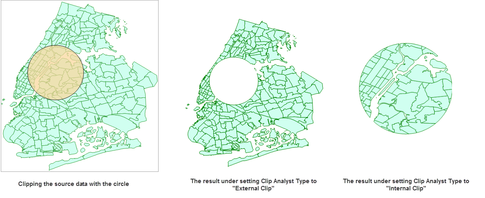

Clips the input dataset and saves the result in another dataset.

Only one object from the clipping dataset can be used for clipping the input
data, and if there are multiple objects in the clipping dataset, the object
with the minimum SmID value will be adopted as the clipping object.

###  Function Entrance

  * Click the Online tab > Analysis group > Vector Clip.

###  Basic steps

1. **iServer Address**: choose an address for iserver login. For specific instructions, please refer to [data input](DataInputType).
2. **Source Data**: specify the dataset which will be clipped by the clipping dataset. Click on the drop-down button and select a dataset from the drop-down list. All of datasets in the drop-down list are filtered out for the analysis.
3. **Analysis parameter settings**: 
  * **Clip Data**: Required. Specify which dataset will be used for clipping the source dataset. 
  * **Analysis Parameters**: Specify which part of data in the source dataset will be saved into the result dataset. 
4. Click OK to perform the analysis, and the result will be opened automatically on the map window and its path will be output in the output window.

### Related topics

 [Environment Configuration](BigDataAnalysisEnvironmentConfiguration)

 [Data Preparation](DataPreparation)
