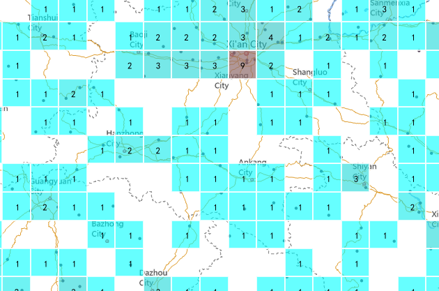
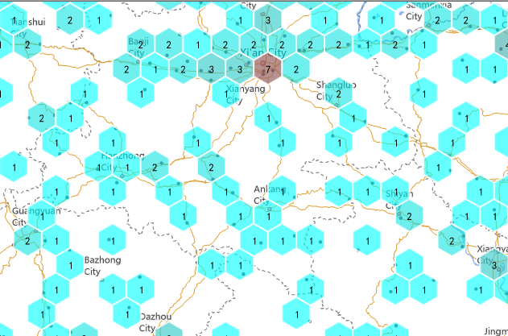
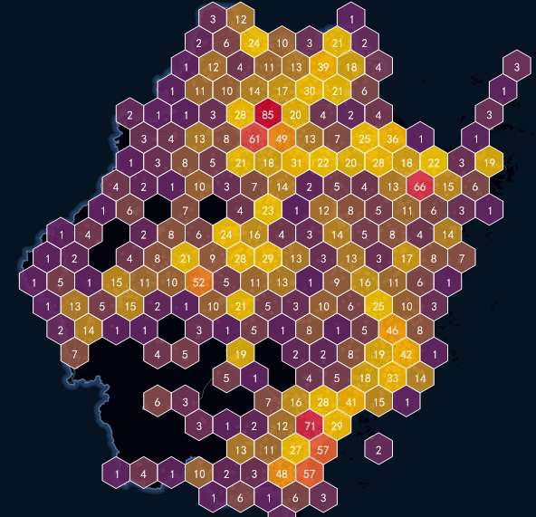

---
id: GridAggregationMap
title: Grid Map
---  

### Introduction

The grid map is simply a method of using spatial aggregation method to express
the distribution and statistical characteristics of spatial data. Its basic
principle is that: based on the grid aggregation algorithm, the spatial region
is divided into the grid cells in regular shape, each grid cell is divided
into multiple levels, high-level grid cells are divided into multiple low-
level cells, and each grid cell has statistics information.

SuperMap supports the construction of grid aggregation map for the point
dataset, and provides two types of grid types for display, one is rectangular
and the other one is hexagonal. Then the number of points in each grid cell is
calculate and is as the statistical value of the grid, the weight information
of the point can also be introduced; Finally, based on soring the statistics
values of the grid cells, use different color to fill the grids.

The grid map contains the following elements:

  * **Grid Type** : Each grid cell is a uniformly sized grid that can be quadrilateral or hexagonal. The size of each grid cell is fixed. Each grid is used to count the points falling within each grid cell.
  * **Label** : Each grid has a label that is the statistical value of the grid cell, which can be the number of point objects falling within each grid cell, or the weighted value.
  * Grid Style**: The fill color of the grid cell represents the distribution trend of the grid statistics, and its color is from deep to shallow, indicating that the value of the grid cell is from large to small. In addition, you can also set the grid rectangle border style.

### Function Entrances

Select your point layer in the layer manager.

  * **Thematic Mapping** > **Aggregation Map** > **Grid Map**.
  * Right click on your point layer and select **Create Thematic Map...** > **Aggregation Map** > **Grid Map**.

### Basic steps

1. A new grid thematic map is produced in the layer manager. 
2. Right-click the grid layer and select Modify Thematic Map. The pop-up Layer Properties panel shows all setting information.
3. You can set parameters in the Layer Properties panel to adjust the grid map.
  * View Control: Set the visibility, name, title, transparency, visible scales of the layer.
    * Visible: Check it to make the layer visible. 
    * Layer Name: The name of the layer. 
    * Layer Caption: The displayed name of the layer in Layer Manager. 
    * Transparency: Set the transparency ratio. The default is 0, representing completely opaque. With the increase of number, the layer become more and more transparent. The value range is 0-100.
    * Min Visible Scale: When the map scale is smaller than the value, the layer will be invisible.
    * Max Visible Scale: When the map scale is larger than the value, the layer will be invisible.
  * **Change Dataset** : Re-specify a datasource and a dataset. For more details, please refer to [Respecify the Dataset](../../Visualization/LayerManagement/RespecifyAssociatedData).
4. **Parameter Settings** :
  * **Grid Field** : Specifying a grid field is not a must. If you don't specify a field, the grid map's statistics value is the number of point objects that fall in the cell. But if a grid field is specified, the value of the field will be the weight information. In addition, the specified grid field must be a numeric field. 
  * **Display Precision** : Set the display precision of the statistical values of grids. For example, the given grid value is 178.3129. If you set the display precision to 0.1, the displayed value will be 178.3 on the map. Else if you set it to 0.001, the displayed grid value will be 178.312.
  * **Aggregation Function** : After specifying a grid field, you can set the aggregation way. iDesktop provides 5 aggregation methods including Average, Count, Max, Min, and Sum. 
  * **Grid Type** : SuperMap provides two gridding types including quadrilateral grid and hexagonal grid.
   
  * **Length** : setting the length of each grid. Unit is pixel.
  * **Color Scheme** : Select the desired color scheme, the system will automatically assign the theme style of each render field value.
    * Set the maximum color and minimum color values respectively. Construct a gradient ribbon with the maximum color and minimum color, and the maximum color is used to render the largest grid cell. The minimum color is used to render the minimum grid cell. The other grid cells use the other colors in the gradient ribbon, where it follows the rule that the larger the cell value, the closer to the maximum color value.
    * It supports making a semi-transparent effect, easy to overlay with the basic map data.
  * **Original Point Visible Scale** : Specify the minimum visible scales of your point dataset layer. SuperMap provides ten optional values including 1: 5000, 1: 10000, 1: 25000, 1: 50000, 1: 100000, 1: 250000, 1: 500000, 1: 1000000, the current scale, and system-default scale. You are allowed to define a new scale. 
    * **System Default Scale** : the program will calculate a scale as the visible scale of the original points according to the current grid map. When the map scale is smaller than the specified one, the original points will be invisible.
    * **Set to Current Scale** : Take the current map scale as the minimum visible scale of the point dataset layer.
  * **Grid Style** : 
    * **Show Label** : Check it to display the labels. Click the button  to set the style for the labels like font type, font color, font effect, etc, where the font size is not supported.
    * **Line Type** : There are three styles: no border, solid line border, dotted line border; also can set border width and the border line color, and it supports translucent effect settings.
5. After all parameter settings, you can create a grid map based on a point dataset.

### Sample Application

A heat map can represent spatial distribution and changing trend of a
geographic phenomenon like density and temperature with colors intuitively.
The following map is produced from point data, reflecting tourist sites
distribution of Zhejiang province.

Sample data path: SampleData > AggregationMap > GridAggregationMap

  
