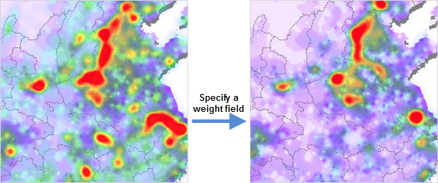
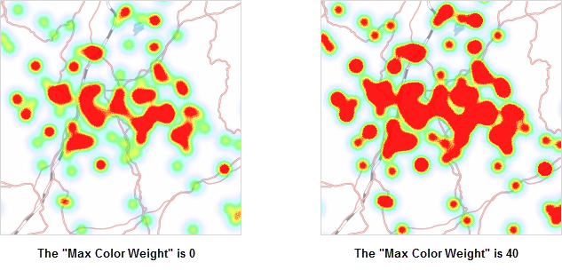
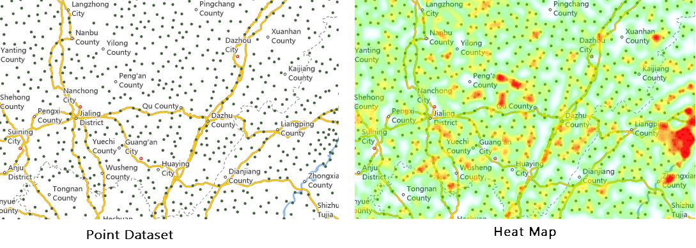

### Introduction

The heat map uses colors to depict phenomenon such as population distribution,
density, and the trend of change. It is a very intuitive way to present some
data, such as density, frequency, temperature, etc.

A heat map can create a buffer zone for each discrete point, then using a gray
gradient color to fill in each buffer zone. Since colors can overlay with each
other, and the more overlays, the more bright color, the heat map will present
a hot phenomenon in the area where has a lot of zone intersections. In
general,low density and high density points are drawn with cool color to warm
color. You need to turn on alpha channel of the map for the heat map.

In addition to reflecting the relative density of points, the heat map layer
can also represent the point density weighted according to attributes.

The heat map changes over zooming in or out the map. It is dynamic raster
surface. For example, when zooming in a map, the heat map layer for visitors
of national tourist attractions will reflect the distribution of visitors of
tourist sites in a province or in a local area.

SuperMap allows to create a heat map from a point dataset.

### Function entrances

Select your point layer in the layer manager.

* **Thematic Mapping** > **Aggregation Map** > **Heat Map**.
* Right click on your point layer and select **Create Thematic Map...** > **Aggregation Map** > **Heat Map**.

### Basic steps

1. iDesktop will produce a heat layer in the layer manager. 
2. Right click on the heat map layer and select **Modify Thematic Map** to open the panel Layer Properties.
3. You can set parameters in the Layer Properties panel to adjust the heat map.
  * **Display Control** : Sets layer visibility, layer name, layer caption, transparency, and max/min visible scale.
    * **Visible** : In the Layer Properties panel, you are allowed to set the visibility of all layers uniformly. If you check Visible, all selected layers will be visible; otherwise, all selected layers will be invisible. 
    * **Layer Name** : Used to display the name of the selected layer group. You can not change the name of the layer group. Layer group name is used to uniquely identify the layer group in the map.
    * **Layer Caption** : The text box on the right is used to display the title of the selected layer group. You can modify the layer group title, and the display name in the Layer manager after the modification. The name of the layer group will not change. 
    * **Transparent** : You can input the transparency directly in the combo box, or move the slider to adjust the transparent. You can view the effects in the real time in the map. The value range is 0 to 100. The default is 0, representing completely opaque. As the number grows, the layer become more and more transparent. 100 indicates completely transparent.
    * **Min Visible Scale** : The box is used to set the minimum visible scale of all layers in the layer group. When you have set the minimum visible scale for a layer group, all layers in the layer group will not be visible if the scale of the map is smaller than the specified minimum visible scale of the layer group. You can directly enter a scale value, such as 1:500,000, or set the current map scale to the minimum visible scale. You can also click the Right Drop-down button to select the scale to be the minimum visible scale, and 8 scales from 1:5000 to 1:1 million are provided. If the map is set to fixed scales, you can only select fixed scales from the dropdown list.
    * **Max Visible Scale** : The box is used to set the maximum visible scale of all layers in the layer group. When you have set the maximum visible scale for a layer group, all layers in the layer group will not be visible if the scale of the map is smaller than the specified maximum visible scale of the layer group. You can directly enter a scale value, such as 1:500,000, or set the current map scale to the maximum visible scale. You can also click the Right Drop-down button to select the scale to be the maximum visible scale, and 8 scales from 1:5000 to 1:1 million are provided. If the map is set to fixed scales, you can only select fixed scales from the dropdown list.
  * **Change Dataset** : You can select a new dataset from a datasource from the dropdown lists. For details, please refer to [Change Dataset](../../Visualization/LayerManagement/RespecifyAssociatedData).

4. **Parameter Settings** : In the Layer Properties window, you can set parameters to adjust the display of the heat map.
  * **Kernel Radius** : The kernel radius sets the influence radius for the discrete points. The role of the kernel radius in the heat map is as follows:
    * The heat map will create a buffer for each discrete point based on the kernel radius value. The unit of the kernel radius value is: screen coordinate;
    * After the buffer areas have been created for each discrete points, the buffer of each discrete point will be filled with progressive gray band (the complete gray range is 0 to 255) from the inside out from shallow to the deep;
    * Because the gray value can be added when they overlay (the larger the value, the brighter the color, the whiter it will look). In real practice, you can choose any channel in the ARGB model as the overlay gray value, so that the region with buffer intersection can have all gray values added. Therefore, the more the buffer crosses, the greater the gray value, the more "hot" the area is.
    * The heat map will be ready when we redraw the map with a 256 color ramp based on the gray value.
  * **Weight Field** : According to the above, the heat distribution density can be determined according to the overlay of discrete point buffers, and the weight is to determine influence of the point on the density. The weight of a point determines the impact of the buffer of the point on the density. If the original impact coefficient of the point buffer is 1, the weight of the point is 10, then the influence coefficient of the point buffer is 1*10=10 after introducing the weight.

Then, after the weight is introduced, a new gray value after overlay will be
used for indexing. The specified color ramp will be used for rendering to get
the heat map.

You can specify a field as weight. Please notice that the field must be
numerical.

  
---  
  * **Color Scheme** : The combo box lists the color schemes provided. When you select a color ramp, colors will then be assigned automatically.
    * Set the maximum and minimum color values respectively and build a color ramp with the maximum and minimum color values. The color with maximum value will be used to render the heat map with maximum gray value (the hottest area), while the color with the minimum value will be used to render the heat map with minimum gray value (the coldest area).
    * Adjust the transparency of the color, click the right button to the max/min color box to display the slider for setting the transparency of the color. You can change the transparency with the slider, or directly enter a number from 0-100. The default is 0, fully opaque. The heat map with translucent effect is easy to overlay with the base map. 
  * Color Gradient Fuzzy Degree: Adjust the blur degree of the color gradient in the heat map, therefore adjusting the rendering effect of the color ramp. 
  * Max Color Weight: Determine the proportion of the maximum color value in the gradient ramp. The larger the value, the greater weight the maximum color takes up in the color ramp.
  
 
  * **Original Point Visible Scale** : Specify the minimum visible scales of your point dataset layer. SuperMap provides ten optional values including 1: 5000, 1: 10000, 1: 25000, 1: 50000, 1: 100000, 1: 250000, 1: 500000, 1: 1000000, the current scale, and system-default scale. You are allowed to define a new scale. 
    * **System Default Scale** : the program will calculate a scale as the visible scale of the original points according to the current heat map. When the map scale is smaller than the specified one, the original points will be invisible.
    * **Set to Current Scale** : Take the current map scale as the minimum visible scale of the point dataset layer. When the map scale is smaller than the specified one, the original points will be invisible.
  * **Extremum Value Settings** : Set a maximum value and a minimum value of your heat map, then according to the colors of extremum values to render your heat map. The colors of other parts that values are greater or less than the extremum values are the same with the color of maximum or the color of minimum value. 
    * **Current View Extremum Value** : Take the extremum values in the current view as the extrimum values of a heat map to render your heat map. (The extremum values are changing with zooming in/out current view.)
    * **System Extremum Value** : In default, the application will calculate out a default maximum value and a default minimum value of a heat map. (The system extremum values vary with scales).
    * **Userdefine Extremum Value** : You can input a maximum value and a minimum value to render your heat map.
5. A heat map has been created based on the above parameters. 

### Sample Application

The heat map based on traffic data of map sampling points describes traffic
intensity trend.

Sample data path: SampleData > AggregationMap > HeatMap

  
