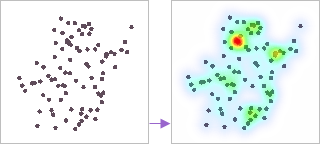
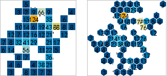

Big data visualization is everywhere nowadays. Requirements for data
visualization are growing over time and data visualization has became a new
way of reading and understanding information. In GIS field, big data can be
mined by the way of big data visualization to present user data spatial
distribution pattern, trend, relevance and statistics information.

Big data visualization can be done in real time, and the result can be updated
with the changes of scales. iDesktop allow you to achieve data visualization
by one click.

### Summary Sheets:

 [Heat map](../BigdataVisualization/AggregationMap/HeatMap)

One of ways of big data visualization. You can through a heat map to present
temperature, density and access frequency, etc. By big data visualization,
valuable information can be extracted from big data and then be displayed
intuitively.

  

  
 [Grid aggregation map](../BigdataVisualization/AggregationMap/GridAggregationMap)

Grid aggregation maps can present distribution and statistics characteristics
of spatial data. Two shapes are provided for the display of a grid aggregation
map, one is rectangle, and another is hexagon.

  

