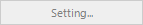
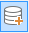
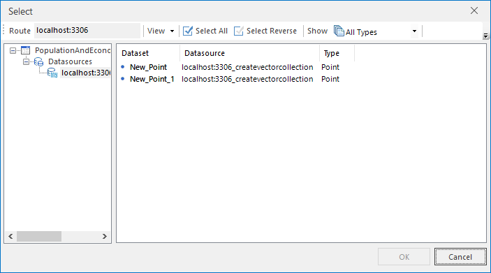
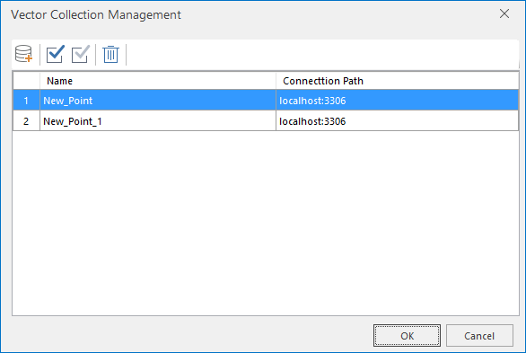

### Instructions

Vector collections are used to store vector datasets with the same data type
and the same projected coordinate system. The application supports the
creation of new vector collections in UDB, OraclePlus, PostgreSQL data
sources. The essence is to create an empty dataset that can hold multiple
vector datasets. After successful creation, datasets with the same data type
and the same projection coordinate system can be loaded into a vector dataset,
where the subdataset must be non-UDB data. It is often applied to large data
volume dataset management to facilitate centralized management and
application.

### Basic Steps

  1. On the "Start" tab in the "New Dataset" gallery, click "Vector Collection" button to create a new vector collection. Only there is an opened workspace in the current workspace, the operation can be activated.
  2. In the pop-up dialog box "New Vector Dataset", set basic parameters of the vector collection.
  
---  
Figure: "New Vector Collection" dialog box  
    * **Target Datasource:** Select a datasource to save your dataset collection. 
    * **Dataset Name:** Set the name of your vector dataset collection.
    * **Subset Type:** Set the dataset type. Three types are provided: points, lines, regions.
    * **Projection Settings:** Set the projection settings for new vector colloection. Click  button to open "Coordinate System Settings" dialog box where you can set the coordiante system. For details, please refer to [Set Coordinate System](../Projection/SetPrjCoordSys.htm).
      * The coordinate system information of the first dataset will be shown in the coordinate system information box by default.
      * When all the coordinate systems of selected datasets are not inconsistent, a prompt will be shown in Output window: Adding the vector dataset unsuccessfully: The projection of the dataset is not consistent with the collection's.
  3. At the right of the dialog box, a lot of tools are supplied: "Add", "Select All", "Select Reverse", "Show", and searching etc.. 
    * Click  button to open the "Select" dialog box, there is a datasource list at the right of the box. You can click a datasource, and all the dataset in the datasource with the same type will be shown on the list at the right of the box.
  
---  
Figure: "Select" dialog box  
    * Click "OK" button to add the selected datasets. Repeat above steps to add other types of datasets.
  4. Click "OK" button to create a vector collection.
  5. **Vector Collection Management** : In the Workspace Manager, select your vector collection and right click, then click the "Manage Vector Dataset" to open the "Vector Collection Management" dialog box where you can perform the addition and deletion operations.
  
---  
Figure: "Vector Collection Management" dialog box  
  6. **Properties of a vector collection** : Select your vector collection then right click and select "Property" to open "Properties" windows. Four panels are shown in the "Properties" windows: Dataset, Coordinate, Attribute Table, Vector Collection. The following information are displayed in the "Vector Collection" panel: 

**Subset Count:** The number of sub sets in the vector collection. Click
"Settings..." and the "Vector Collection Management" dialog box appears where
you can manage the collection.

**Subset Type:** Show the types of datasets in the vector collection.

