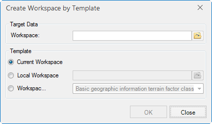

SuperMap provides the function to create workspace from template. With this
function, the created workspace will have the consistent datasource, dataset,
map, layout and scene. There are some differences:

  * The datasource name and projection are consistent; 
  * The dataset number, type, name, attributes table structure, projection, char-set, encoding, and domain are consistent;
  * The objects N.O. in the dataset is 0, the data bounds are null, and the index type is no spatial index.

There are two places to access this function. One is to click
Start>Workspace>File, select Create from Template...; The other one is to find
the "Open Data" part in Start Tab, click the "Create file workspace based on
template" button. It will open a dialog:

  * Target Data: set the directory and name of the created workspace, the datasource in the workspace will be stored in the same directory.
  * Template: select the workspace template. SuperMap provides three ways: 
    * Current Workspace: the current workspace is the template.
    * Local Workspace: right click to select a local workspace as the template, or input the workpace directory and name.
    * Workspace Template: two templates are provided-national geographical conditions census template and basic geographic information terrain elements template.
  
---  

