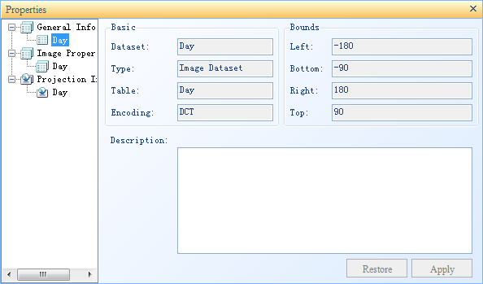
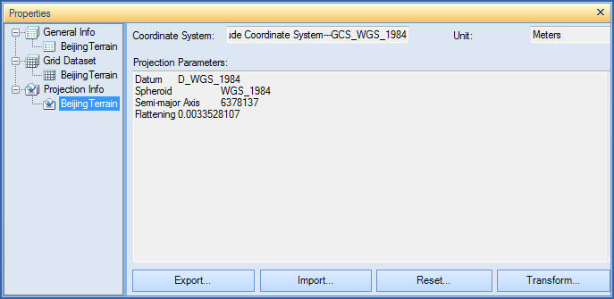
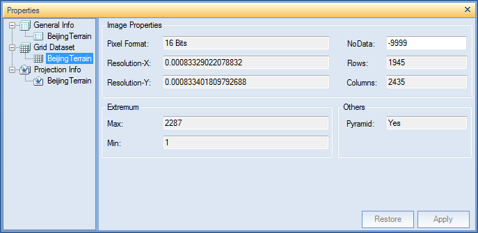

---
id: DTgroupDiaGrid
title: Grid Dataset
---  
The properties of the grid datasets are classified into 3 groups: General
Info, grid Dataset and Projection Info. Each group of the properties are
introduced in detail below:

Property Info

  1. You can click "Dataset" panel on "Property" window to view property information of the grid dataset.
  
---  
Figure: Information about the grid dataset  
  
**Basic:**

    * Dataset: The name of the dataset.
    * Type: The type of the dataset.
    * Table: The name of the attribute table of the dataset.
    * Encoding: The encoding mode of the grid dataset. For more information on different encoding modes, please refer to [Encoding Modes for Dataset Compression](EncodeType.htm).

**Extent:**

    * Top, Bottom, Left and Right: The boundary of the grid dataset. The unit of 4 values is identical to that of the dataset. 
    * **Copy and paste** : Copy and paste current dataset range by clicking Copy button and Paste button.

**Description:**

    * The descriptive information about the grid dataset. You can modify it according to your needs.

Projection

  1. You can click a child node under the Projection Info node on the "Property" window to display the projection information about the corresponding grid dataset.    
---  
Figure: The projection information about the grid dataset  
    * Coordinate System Name: The name of the coordinate system employed by the grid dataset.
    * Unit: The distance unit of the grid dataset.
    * Coordinate Information: The detail about grid dataset projection.
  2. Buttons at the bottom of the Coordinate Information window: 
    * Reset: Set the projection of the grid dataset again. To know how to reset projection, please refer to [Projection Settings Window](../Projection/PrjCoordSysSettingWin.htm).
    * Copy: Click Copy button to copy coordinate system information as projection information of current dataset. You can copy information from the existed datasource or dataset or local projection information file (seven kinds of files: *.TIF, *.SIT, *.IMG, *.SHP, *.MIF, *.TAB, *.XML). 
    * Export: Export the projection of the grid dataset to an .xml file.
  
---  
    * Convert: This button is to convert current projection information for the selected dataset. For detail settings, please see [Convert projection](../projection/ConvertPrjCoordSys.htm).

Raster

  1. You can click a child node under the grid Dataset node to display the dataset information about the corresponding grid dataset.    
---  
Figure: The dataset information about the grid dataset  
  
**Image Properties:**

    * Pixel Format: The number of bits used to represent the color value of each pixel in a grid dataset.
    * Resolution X: The resolution in the X direction.
    * Resolution Y: The resolution in the Y direction.
    * NoData: The value for cells with no data.
    * Rows: The number of rows of the pixel matrix for the grid dataset.
    * Columns: The number of columns of the pixel matrix for the grid dataset.
    * Color Scheme: Used to set the display color for pixel of grid dataset. This setting is useful only for the grid dataset, if you want to modify the color table of the grid dataset in map, please see [Color Table Setting](../../Visualization/VisualSetting/ColorTableDia.htm).
    * Raster Blocks: The size of grid block.

**Extremum:**

    * Max: The maximum cell value. 
    * Min: The minimum cell value. 

**Others:**

    * **Pyramid:** Whether the grid dataset has created the pyramid.
    * **Extent:** The extent of the grid dataset on the map. 

Click the Settings button. A Set Visible Extents will pop up. You can select a
region dataset as the visible extent of the grid dataset. Or, you can click
, and type the filter conditions to control the visible
extent. See [SQL Expression](../../Query/SQLDia.htm).

  
---  
  
The display range of dataset can be entire by clicking "Reset".

###  Note

For image datasets, the Projection Transformation button the the Properties
dialog box is disabled. You can only transform projections for image datasets
using the Projection Transformation function in the Data group of the Start
tab or by rightcliking the dataset. For details, check the page [Projection
Transformation](../Projection/ConvertPrjCoordSys.htm).

