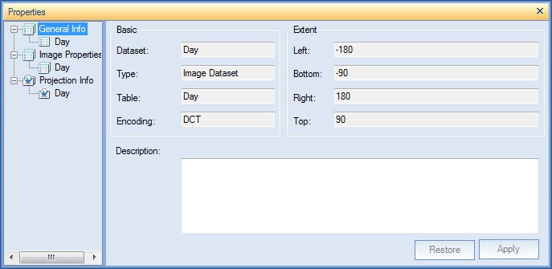
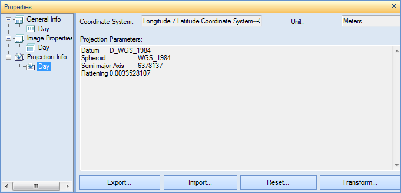
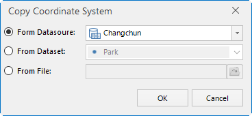
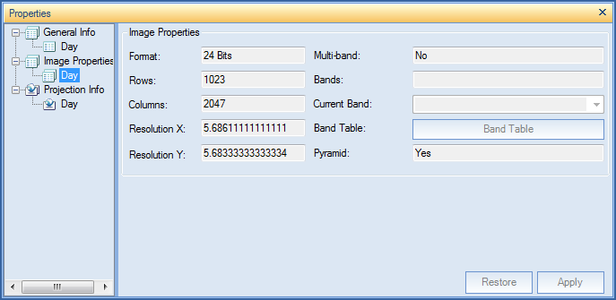
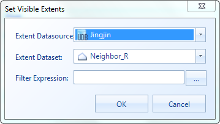

---
id: DTgroupDiaImage
title: Image Dataset  
---  
The properties of the image datasets are classified into 3 groups: General
Info, Image Dataset and Projection Info. Each group of the properties are
introduced in detail below:

General Info

  1. You can click a child node under the General Info node to display the general information about the corresponding image dataset.
  
---  
Figure: The projection information about the image dataset  
  
**Basic:**

    * Dataset: The name of the dataset.
    * Type: The type of the dataset.
    * Table: The name of the corresponding database table if the image dataset is from a database datasource; the name of the attribute table if the image dataset is from a file datasource.
    * Encoding: The encoding mode of the image dataset. For more information on different encoding modes, please refer to [Encoding Modes for Dataset Compression](EncodeType.htm).

**Extent:**

    * Top, Bottom, Left and Right: The top, bottom, left and right boundary of the image dataset. The unit of values is identical to that of the dataset.
    * **Copy and paste** : Copy and paste current dataset range by clicking Copy button and Paste button.

**Description:**

    * The descriptive information about the image dataset. You can modify it according to your needs.

Projection Info

  1. You can click a child node under the Projection Info node to display the projection information about the corresponding image dataset.    
---  
Figure: The projection information about the image dataset  
    * Coordinate System: The name of the coordinate system employed by the image dataset.
    * Unit: The distance unit of the image dataset.
    * Coordinate System Parameters: The parameters of the coordinate system of the image dataset.
  2. Buttons at the bottom of the Properties window: 
    * Reset: Set the projection of the grid dataset again. To know how to reset projection, please refer to [Projection Settings Window](../Projection/PrjCoordSysSettingWin.htm).
    * Copy: Click Copy button to copy coordinate system information as projection information of current dataset. You can copy information from the existed datasource or dataset or local projection information file (seven kinds of files: *.TIF, *.SIT, *.IMG, *.SHP, *.MIF, *.TAB, *.XML).    
---  
    * Export: Export the projection of the grid dataset to an .xml file.
    * Convert: This button is to convert current projection information for the selected dataset. For detail settings, please see [Convert projection](../projection/ConvertPrjCoordSys.htm).

Image Properties

  1. You can click a child node under the Image Dataset node to display the dataset information about the corresponding image dataset.    
---  
Figure: The dataset information about the image dataset  
  
**Image Properties:**

    * Band Number: Displays the number of bands included in the multi-band image dataset. 
    * Resolution X: The resolution in the X direction.
    * Resolution Y: The resolution in the Y direction.
    * Raster Blocks: The size of grid block.
    * NoData: Display the NoData of the specified band. 
    * Rows: The number of rows of the pixel matrix for the image dataset.
    * Columns: The number of columns of the pixel matrix for the image dataset.

**Band Information:**

    * **Index:** Displays index of the currently displayed band of the multi-band image dataset. 
    * **Name:** Displays the names of all the bands. 
    * **Pixel Format:** Displays the pixel format, that is, how many bits for each pixel. 

**Others:**

    * **Pyramid:** Whether the raster dataset has created the pyramid.
    * **Extent:** The extent of the raster dataset on the map. 

Click the Settings button. A Set Visible Extents will pop up. You can select a
region dataset as the visible extent of the raster dataset. Or, you can click
, and type the filter conditions to control the visible
extent. See [SQL Expression](../../Query/SQLDia.htm).

  
---  
  
The display range of dataset can be entire by clicking "Reset".

