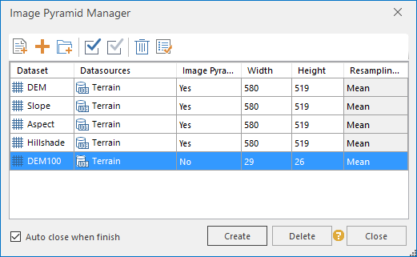

### Description

Creates pyramids for raster/voxel grid/image datasets (the data formats should
be tiff, tif, img) to increase the browsing speed.

### Basic Steps

      1. On the **Data Processing** group of **Start** tab, click the **Image Pyramid** button, and the **Image Pyramid Manager** window pops up, as shown below:
  
---  
Figure: The **Image Pyramid Manager** window  
      2. In the **Image Pyramid Manager** , there are three ways to add data to create image pyramids: 
        * Click on the Add button . In the **Select** dialog box, select the files to create pyramids. Click **OK** button to finish.
        * Click on the "Add File" icon to head to the Open dialog box where you can specify your local image files to create pyramids.
        * Click the button  to open the dialog box "" where you can specify the folder path as needed to add files (IMG or TIFF files).
      3. The selected grid files will be added to the list of **Image Pyramid Manager** automatically. And it will read the information of width, height, and whether exist the image pyramids, etc. For the files that don't have the image pyramid, you can directly click the **OK** button to excute the operations. Or you should delete the existing image pyramid, then rebuild the image pyramid.

**Note** : If you want to delete the image pyramids of files which are
imported in the way of adding files, please delete the *.vor files saved in
the same folder as data.

      4. Two calculation methods are provided: Mean and Near Value. The raster dataset only supports the Near Value. However, the vexel grid only supports the Mean algorithm.

     **You can create the image pyramid through the context menu, and the operating steps are as follows:**

      1. Right click a raster/image dataset node in the Workspace Manager tree, and click Create Image Pyramid.
      2. The creation success or failure prompt displays in the Output Window.

### Note

The Create Image Pyramid command will be unenabled if pyramids have been
created for the dataset.

