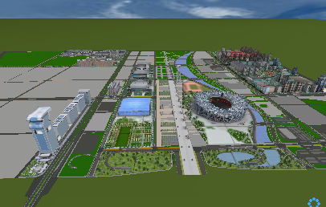
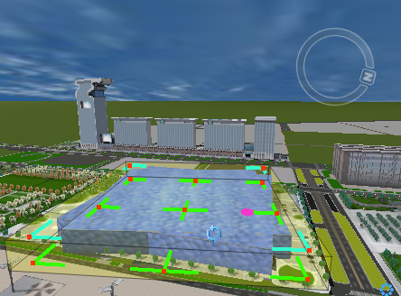

---
id: CADModelDataset
title:  CAD Model Dataset  
---  
CAD model dataset is a new dataset mode of the SuperMap, which converts the 
CAD model into a dataset to save, and achieves the identity of the management 
and operation of the 3D model and datasets of other types, and makes the 
display more efficient and fluent.  supports the import, display and editing 
of the CAD model dataset in the scene.

### Display CAD Model Dataset

  * The CAD model dataset must be loaded into the scene. When it is opened in the 2D map window, the model cannot be truly displayed.

The following figure shows the display effect of the CAD model dataset in the scene:

  

### Edit CAD Model Dataset

The CAD model dataset loaded into the scene can be directly edited, stretched, moved, rotated, deleted, etc. However, the base altitude of a single model cannot be changed by editing.

  * When the mouse pointer becomes the  status, you can rotate the model.
  * When the mouse pointer becomes the  status, you can pan the model.
  * When the mouse pointer becomes the  or  status, you can stretch the model.
  * Holding down the Delete key on the keyboard can delete this model.
  * Holding down the Esc key can cancel this operation.

The basic steps of editing the CAD model data:

  1. On the CAD model dataset, click the right mouse button and select the Editable in the displayed menu to make it editable.
  2. Select the model to be edited in the CAD model dataset and edit it.

The following figure shows the effect of rotating the selected model.

  

