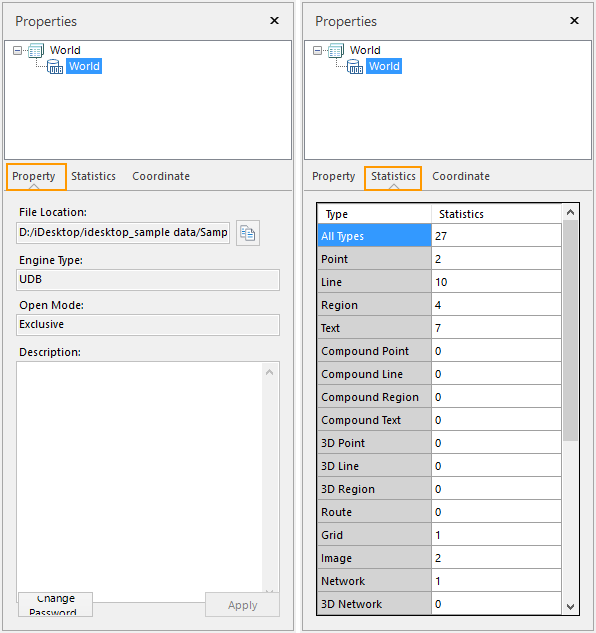

---
id: DatasourceDia
title: Viewing Datasource Properties
---  

Select one or more datasources and right click it or them, then select
"Properties" option to open "Properties" window which is called datasource
property window.

Note: The Properties window is a dock bar, which can be used for displaying
the properties of the workspace, datasources, datasets, etc.

The figure below shows information contained in the Properties window about
the datasources you selected.

  
---  
Figure: Datasource Properties Window  
  
The property information of the datasources are classified into 3 groups:
Property, Statistics and Coordinate. There is a datasource directory in tree
structure, you can select a datasource node, and its detail information will
be shown up below the properties window.

Property info

  1. Select a datasource node in the "Properties" window, and then click "Property", property information of the datasource is shown up below the window.
    * Location: The location of the datasource. For a file datasource, the full save path is displayed; for a database datasource, the database server where the datasource is located is displayed.
    * Engine Type: The engine type of the datasource. To know more about engine types, please refer to **[Datasource Engine Types](EngineType.htm)**. 
    * Open Mode: Whether to open the datasource in Readonly or Exclusive mode.
    * Description: The detailed descriptive information about the datasource. You can edit the description of the datasource. 
    * Change password: Manage the password of the datasource.

Statistics info

  1. The Statistics area displays the statistics on datasets in the datasource.
    * All Types: The total number of datasets in the datasource.
    * All supported dataset types are listed and the number of of each type of dataset is displayed.

Coordinate info

  1. Click Coordinate node and the coordinate information of the datasource is shown below this tab. You are allowed to export, import coordinate system information, reset, or transform coordinate system. 
    * Coordinate System: The name of the coordinate system employed by the datasource.
    * Unit:The distance unit of the datasource.
    * Coordinate System Parameters: The parameters of the coordinate system of the datasource.
  2. Buttons at the bottom of the Properties window: 
    * Export: Export the projection of the datasource to an .xml file. 
    * Import: Import a projection for the grid dataset. You can Import a projection from a datasource or dataset in the current workspace or selects a predefined projection file for the grid dataset. The 7 supported projection files are TIFF files, SIT files, Erdas Image files, ArcView shape files, MapInfo exchange format files, MapInfo TAB files and XML files.    
---  
    * **Reset** : Set the projection of the datasource again. To know how to reset projection, please refer to [Projection Settings Window](../Projection/PrjCoordSysSettingWin.htm). 
    * **Transform** : Create a projection transformation method for the datasource. To know how to transform projection, please refer to [Projection Transformation](../Projection/ConvertPrjCoordSys.htm).

